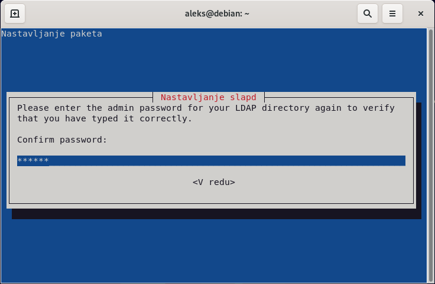
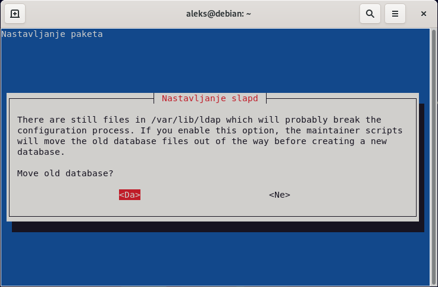
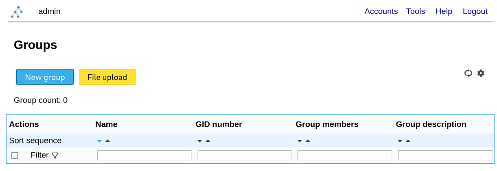
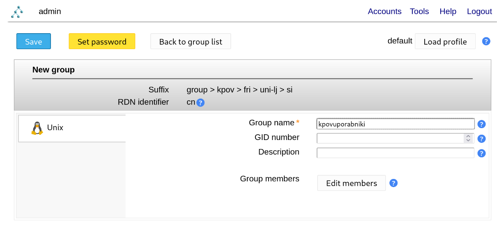
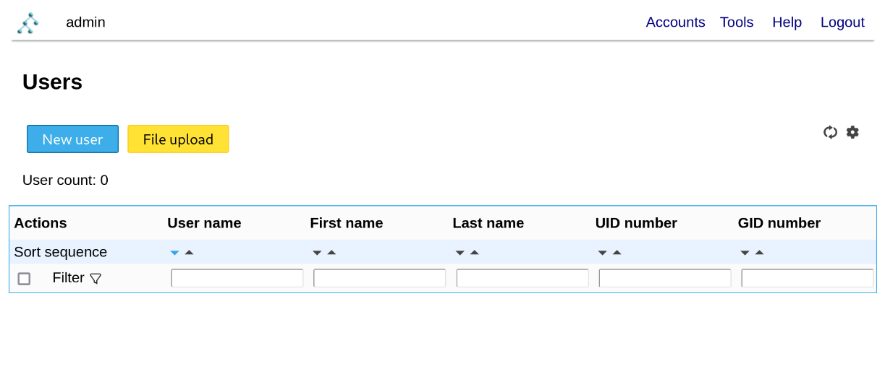
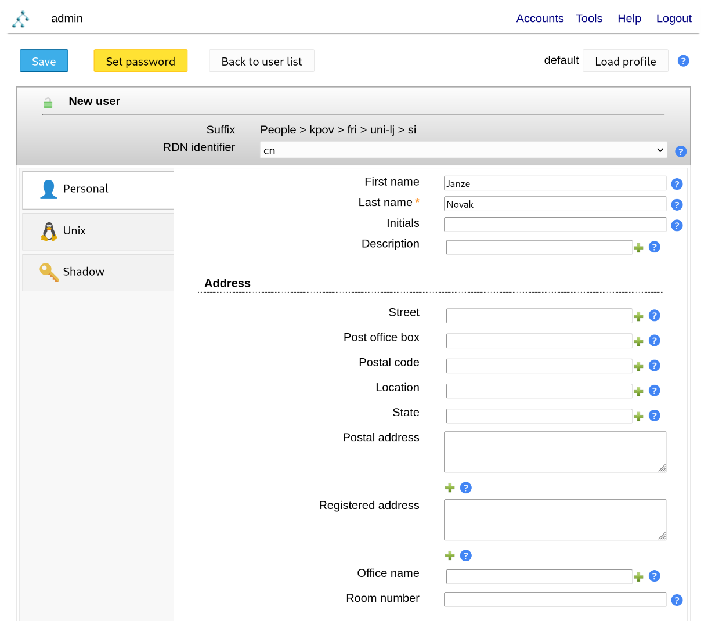
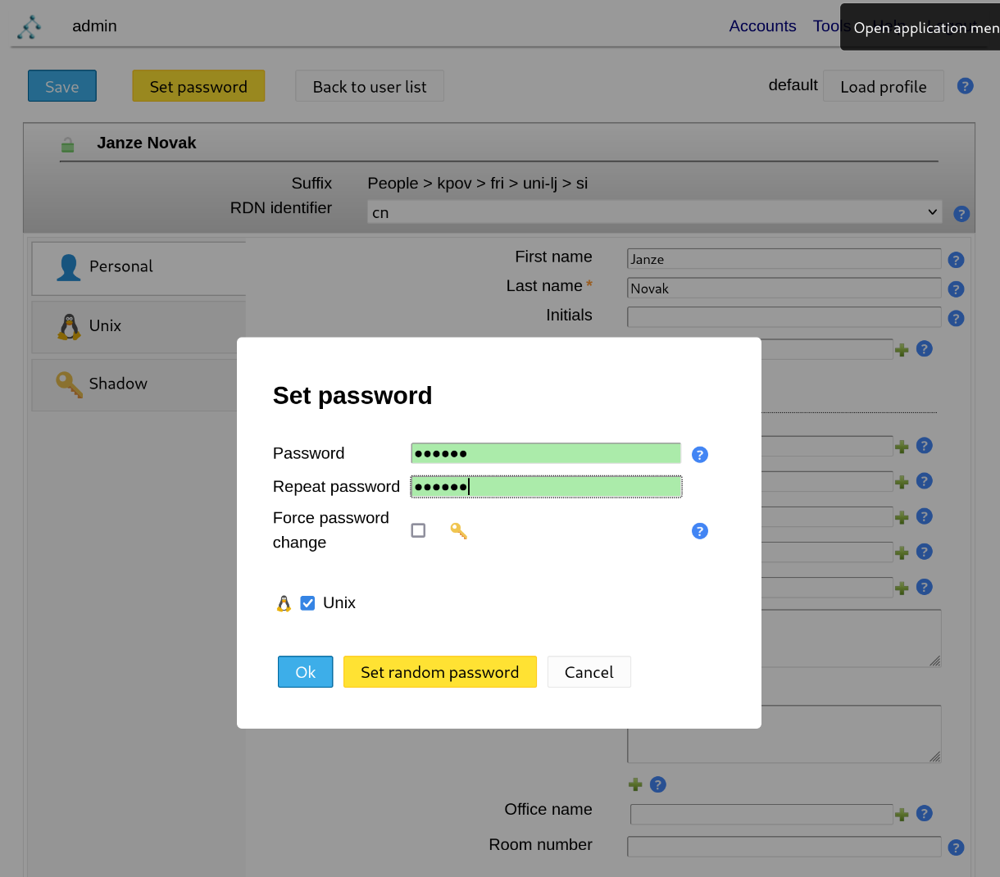
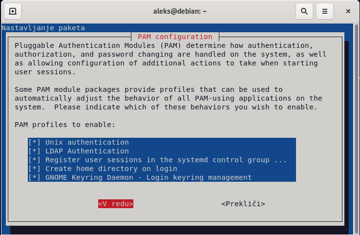

# 13. Lab: Information management in the network

## Instructions

0. Use the network and virtual machines from the previous exercises.
1. Place the LDAP server on the first virtual machine.
2. Set up the web interface for managing the LDAP server.
3. Add two users to the LDAP server via the web interface.
4. Use the command line to query the LDAP server and list both users.
5. On the second virtual machine, use both users to log into the operating system.

## More information

[Lightweight Directory Access Protocol (LDAP)](https://en.wikipedia.org/wiki/Lightweight_Directory_Access_Protocol) is a protocol for accessing and managing distributed directory data over a network. It enables distributed storage of objects with multiple properties defined by schemas. It also defines the LDAP Data Interchange Format (LDIF) and the language for querying stored data.

[LDAP Data Interchange Format (LDIF) ](https://en.wikipedia.org/wiki/LDAP_Data_Interchange_Format) is a standard text format for exchanging and managing data stored in LDAP directories.

[Portable Operating System Interface (POSIX)](https://en.wikipedia.org/wiki/POSIX) represents a family of standards that ensure compatibility between operating systems. They define user and system programming interfaces and tools for ensuring compatibility, for example common presentation of users between several operating systems.

[Pluggable Authentication Module - PAM](https://en.wikipedia.org/wiki/Pluggable_authentication_module) is a mechanism that combines several low-level authentication processes into a high-level programming interface (API).

[Name Service Switch - NSS](https://en.wikipedia.org/wiki/Name_Service_Switch) connects computers with various sources of jointly configured databases and mechanisms for resolving names or users.

[NSLCD - LDAP Connection Daemon](https://linux.die.net/man/8/nslcd) local service for resolving LDAP names or users.

[NSCD - Name Service Cache Daemon](https://linux.die.net/man/8/nscd) a local service for caching the resolution of LDAP names or users.

[`ldapsearch`](https://linux.die.net/man/1/ldapsearch) is a tool that allows us to query the LDAP database.

[`getent`](https://linux.die.net/man/1/getent) command lists records from NSS libraries.

## Detailed instructions

### 1. Task

On the first virtual computer, we install the `slapd` LDAP server implementation and the `ldap-utils` tool for working with the LDAP server through the package manager of our operating system.

    apt install slapd ldap-utils

During the installation, choose an administrator password and press the `OK` button. Then enter the password again and press the `OK` button again.

We can test the operation of the server with the command `ldapsearch`, which allows you to query the LDAP database. For example, we use simplified authentication with the `-x` flag, we choose anything as the starting base with the `-b` flag, we specify the database-level query method with the `-s` flag, and we want to print the `namingContexts` data field for all object classes.

    ldapsearch -x -b '' -s base '(objectclass=*)' namingContexts

    # extended LDIF
    #
    # LDAPv3
    # base <> with scope baseObject
    # filter: (objectclass=*)
    # requesting: namingContexts 
    #

    #
    dn:
    namingContexts: dc=nodomain

    # search result
    search: 2
    result: 0 Success

    # numResponses: 2
    # numEntries: 1

We find that we don't currently have any LDAP database created, so we create one by running the whole LDAP server setup process again.

    dpkg-reconfigure slapd

In the first step, we start the procedure for setting up the LDAP database by selecting the `No` button.

In the second step, we choose the domain of our LDAP database, for example `kpov.fri.uni-lj.si` and press the `OK` button.

In the third step, we choose the name of our organization, for example `KPOV` and press the `OK` button.

In the next step, choose a new administrator password and press the `OK` button. Then enter the password again and press the `OK` button again.

Next, confirm that when removing the `slapd` LDAP server, the LDAP database is also deleted by pressing the `Yes` button.

In the last step, we confirm the movement or deleting the settings of the previous LDAP databases by pressing the `Yes` button so that we can successfully set up a new LDAP database.

Now run the command `ldapsearch` again and check if there is now an LDAP database with our domain.

     ldapsearch -x -b '' -s base '(objectclass=*)' namingContexts

    # extended LDIF
    #
    # LDAPv3
    # base <> with scope baseObject
    # filter: (objectclass=*)
    # requesting: namingContexts 
    #

    #
    dn:
    namingContexts: dc=kpov,dc=fri,dc=uni-lj,dc=si

    # search result
    search: 2
    result: 0 Success

    # numResponses: 2
    # numEntries: 1

### 2. Task

Install any web interface for managing the LDAP server. For example [`LDAP Account Manager`](https://www.ldap-account-manager.org/lamcms/) which can be installed through our operating system's package manager. We also install the `apache2` web server, if we do not have it yet.
    
    apt install apache2 ldap-account-manager

After successful installation, we continue the installation on the web address `http://localhost/lam`. Click on the `LAM configuration` in the upper right corner.

First we click on the `Edit server profiles` link

In order to be able to change the settings, we must enter the `Password` of the server profile `lam`, which is also `lam` by default.

In the `lam` server profile settings, under the `General settings` tab, under the `Tool settings` section, in the `Tree suffix` field, enter the domain of our directory `dc=kpov,dc=fri,dc=uni-lj,dc=si`. Also, under the `General settings` tab, under the `Security settings` section, in the `List of valid users` field, enter the name of our administrator `cn=admin,dc=kpov,dc=fri,dc=uni-lj,dc=si`, which we created it during the `slapd` LDAP server installation.

Now, also in the `lam` server profile settings, under the tab `Account type` under the section `Users` in the `LDAP suffix` we change the user domain to `ou=People,dc=kpov,dc=fri,dc=uni-lj,dc=si`. Als, under the section `Groups` in the field `LDAP suffix` we change the groups domain to `ou=group,dc=kpov,dc=fri,dc=uni-lj,dc=si`. Now we click on the button `Save` to apply the changes.

We login to the web application `LDAP Account Manager` with the username `admin` and password that we setup during the `slapd` installation.

When we first login to the web application, we get the warning that we are missing suffixes for the users and groups. We can create the mentioned suffixes by clicking on the button `Create`.

### 3. Task

We now create a new group by selecting the `Accounts` link at the top right and clicking on the `Groups` link.

We create a new group by clicking in the button `New group`.

In the field `Group name` we name the new group, for example `kpovusers` and create it by clicking the `Save` button at the top left.

Now, lets create two new users, by selecting the `Accounts` link at the top right and clicking on the `Users` link.

We create a new user by clicking in the button `New user`.

Under the tab `Personal` in the field `First name` we fill in the name of our new user and in the field `Last name` the surname, for example `Janze Novak`.

We also have to click on the `Unix` tab, so that the fields necessary for using the LDAP user as a local user of the Linux operating system, are automatically filed out.

By clicking the `Set password` button at the top left, we open a window where we fill the fields `Password` and `Repeat password` with the password for the new user and save it by clicking the button `OK`.

We complete the creation of the new user, by clicking on the button `Save` at the top left. We repeat the same steps for the second new user.

### 4. Task

Locally, the LDAP database can be queried using the `ldapsearch` tool via the command line. 

    ldapsearch -Y EXTERNAL -H ldapi:/// -b dc=kpov,dc=fri,dc=uni-lj,dc=si "givenName=Janze"

    SASL/EXTERNAL authentication started
	SASL username: gidNumber=0+uidNumber=0,cn=peercred,cn=external,cn=auth
	SASL SSF: 0
	# extended LDIF
	#
	# LDAPv3
	# base <dc=kpov,dc=fri,dc=uni-lj,dc=si> with scope subtree
	# filter: givenName=Janze
	# requesting: ALL
	#
	
	# Janze Novak, People, kpov.fri.uni-lj.si
	dn: cn=Janze Novak,ou=People,dc=kpov,dc=fri,dc=uni-lj,dc=si
	objectClass: posixAccount
	objectClass: inetOrgPerson
	objectClass: organizationalPerson
	objectClass: person
	loginShell: /bin/bash
	homeDirectory: /home/jnovak
	uid: jnovak
	cn: Janze Novak
	uidNumber: 10000
	gidNumber: 10000
	sn: Novak
	givenName: Janze

	# Janze Godec, People, kpov.fri.uni-lj.si
	dn: cn=Janze Godec,ou=People,dc=kpov,dc=fri,dc=uni-lj,dc=si
	objectClass: posixAccount
	objectClass: inetOrgPerson
	objectClass: organizationalPerson
	objectClass: person
	loginShell: /bin/bash
	homeDirectory: /home/jgodec
	uid: jgodec
	cn: Janze Godec
	uidNumber: 10001
	gidNumber: 10000
	sn: Godec
	givenName: Janze

	# search result
	search: 2
	result: 0 Success

	# numResponses: 3
	# numEntries: 2

    ldapsearch -Y EXTERNAL -H ldapi:/// -b dc=kpov,dc=fri,dc=uni-lj,dc=si "givenName=Ja*"

    SASL/EXTERNAL authentication started
	SASL username: gidNumber=0+uidNumber=0,cn=peercred,cn=external,cn=auth
	SASL SSF: 0
	# extended LDIF
	#
	# LDAPv3
	# base <dc=kpov,dc=fri,dc=uni-lj,dc=si> with scope subtree
	# filter: givenName=Ja*
	# requesting: ALL
	#
	
	# Janze Novak, People, kpov.fri.uni-lj.si
	dn: cn=Janze Novak,ou=People,dc=kpov,dc=fri,dc=uni-lj,dc=si
	objectClass: posixAccount
	objectClass: inetOrgPerson
	objectClass: organizationalPerson
	objectClass: person
	loginShell: /bin/bash
	homeDirectory: /home/jnovak
	uid: jnovak
	cn: Janze Novak
	uidNumber: 10000
	gidNumber: 10000
	sn: Novak
	givenName: Janze

	# Janze Godec, People, kpov.fri.uni-lj.si
	dn: cn=Janze Godec,ou=People,dc=kpov,dc=fri,dc=uni-lj,dc=si
	objectClass: posixAccount
	objectClass: inetOrgPerson
	objectClass: organizationalPerson
	objectClass: person
	loginShell: /bin/bash
	homeDirectory: /home/jgodec
	uid: jgodec
	cn: Janze Godec
	uidNumber: 10001
	gidNumber: 10000
	sn: Godec
	givenName: Janze

	# search result
	search: 2
	result: 0 Success

	# numResponses: 3
	# numEntries: 2

    ldapsearch -Y EXTERNAL -H ldapi:/// -b dc=kpov,dc=fri,dc=uni-lj,dc=si "(&(givenName=Ja*)(uid=jnovak))"

    SASL/EXTERNAL authentication started
	SASL username: gidNumber=0+uidNumber=0,cn=peercred,cn=external,cn=auth
	SASL SSF: 0
	# extended LDIF
	#
	# LDAPv3
	# base <dc=kpov,dc=fri,dc=uni-lj,dc=si> with scope subtree
	# filter: (&(givenName=Ja*)(uid=jnovak))
	# requesting: ALL
	#

	# Janze Novak, People, kpov.fri.uni-lj.si
	dn: cn=Janze Novak,ou=People,dc=kpov,dc=fri,dc=uni-lj,dc=si
	objectClass: posixAccount
	objectClass: inetOrgPerson
	objectClass: organizationalPerson
	objectClass: person
	loginShell: /bin/bash
	homeDirectory: /home/jnovak
	uid: jnovak
	cn: Janze Novak
	uidNumber: 10000
	gidNumber: 10000
	sn: Novak
	givenName: Janze

	# search result
	search: 2
	result: 0 Success

	# numResponses: 2
	# numEntries: 1

We can also query the LDAP database from another virtual computer with the `ldapsearch` tool, which is installed with the `ldap-utils` package via the package manager of our operating system.

    apt install ldap-utils

    ldapsearch -H ldap://SERVER_IP:389/ -D cn=admin,dc=kpov,dc=fri,dc=uni-lj,dc=si -b dc=kpov,dc=fri,dc=uni-lj,dc=si "(|(sn=G*)(uid=jnovak))" -W

    # extended LDIF
	#
	# LDAPv3
	# base <dc=kpov,dc=fri,dc=uni-lj,dc=si> with scope subtree
	# filter: (|(sn=G*)(uid=jnovak))
	# requesting: ALL
	#
	
	# Janze Novak, People, kpov.fri.uni-lj.si
	dn: cn=Janze Novak,ou=People,dc=kpov,dc=fri,dc=uni-lj,dc=si
	objectClass: posixAccount
	objectClass: inetOrgPerson
	objectClass: organizationalPerson
	objectClass: person
	loginShell: /bin/bash
	homeDirectory: /home/jnovak
	uid: jnovak
	cn: Janze Novak
	uidNumber: 10000
	gidNumber: 10000
	userPassword:: e1NTSEF9VFY2V0FldE9QeGpkc05KL2Y3ZlBlSXlpQkVabFVHcHk=
	sn: Novak
	givenName: Janze
	
	# Janze Godec, People, kpov.fri.uni-lj.si
	dn: cn=Janze Godec,ou=People,dc=kpov,dc=fri,dc=uni-lj,dc=si
	objectClass: posixAccount
	objectClass: inetOrgPerson
	objectClass: organizationalPerson
	objectClass: person
	loginShell: /bin/bash
	homeDirectory: /home/jgodec
	userPassword:: e1NTSEF9cnFaQ3ZwRTg1a05TTDZsSVlpTjQ3Y0VISU50V1Z6Ukk=
	uid: jgodec
	cn: Janze Godec
	uidNumber: 10001
	gidNumber: 10000
	sn: Godec
	givenName: Janze
	
	# search result
	search: 2
	result: 0 Success
	
	# numResponses: 3
	# numEntries: 2

### 5. Task

On another virtual computer, we install the `libpam-ldapd` package, which takes care of user authentication (Pluggable Authentication Module - PAM) and `libnss-ldapd`, which takes care of the mapping between LDAP and operating system users (Name Service Switch - NSS).

    apt install libpam-ldapd libnss-ldapd

During the installation, we must specify the IP address of our first virtual computer on which the LDAP server is running and press the `OK` button.

Then we enter the domain of our LDAP database, which is located on our LDAP server, and press the `OK` button.

We select the `passwd` base of users, the `group` base of groups and the `shadow` base of passwords, which we will map to LDAP users.

Let's check if the LDAP users are already reachable as local users of the operating system with the command `getent`.

    getent passwd aleks

    aleks:x:1000:1000:Aleks,,,:/home/aleks:/bin/bash

    getent passwd jnovak

	jnovak:*:10000:10000:Janze Novak:/home/jnovak:/bin/bash
    
    getent passwd jgodec

	jgodec:*:10001:10000:Janze Godec:/home/jgodec:/bin/bash

If by chance we do not see LDAP users as local users of the operating system, then we reconfigure the `nslcd` package (NSLCD - LDAP Connection Daemon), which is a local service for resolving LDAP names or users. Where we again enter the IP address of our first virtual computer on which the LDAP server is running and press the `OK` button.

     dpkg-reconfigure nslcd

Then we enter the domains of our LDAP database, which is located on our LDAP server, and press the `OK` button.

Now we choose not to use any LDAP authentication `none` and press the `OK` button.

We also choose not to encrypt the connection to our LDAP server by pressing the `No` button.

We run the package settings again, where we have to select the user base `passwd`, the group base `group` and the password base `shadow`.

    dpkg-reconfigure libnss-ldapd

Now we restart `nslcd` and `nscd` (NSCD - Name Service Cache Daemon), which performs caching for `nslcd`, and run the `getent` command again to check if our LDAP users are already reachable as local operating system users.

    service nslcd restart
    service nscd restart

    getent passwd jnovak

	jnovak:*:10000:10000:Janze Novak:/home/jnovak:/bin/bash
    
    getent passwd jgodec

	jgodec:*:10001:10000:Janze Godec:/home/jgodec:/bin/bash

Now enable authentication by running the `pam-auth-update` command and choosing to enable `Unix authentication`, `LDAP authentication`, `Register user sessions in the systemd control group...`, `Create home directory on login` and `GNOME  Keyring Deamon - Login keyring management` and press the `OK` button.

    pam-auth-update

Now let's login with the LDAP user to our local operating system to test the operation, for example with `ls` and `su` commands.

    ls /home

    aleks

    su - jnovak

    Creating directory '/home/jnovak'.

    ls /home

    aleks jnovak

    su - jgodec

    Creating directory '/home/jgodec'.

    ls /home

    aleks jnovak jgodec