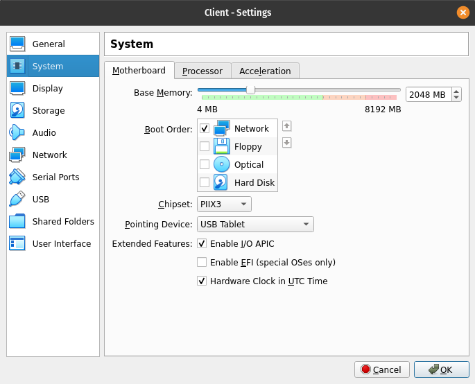
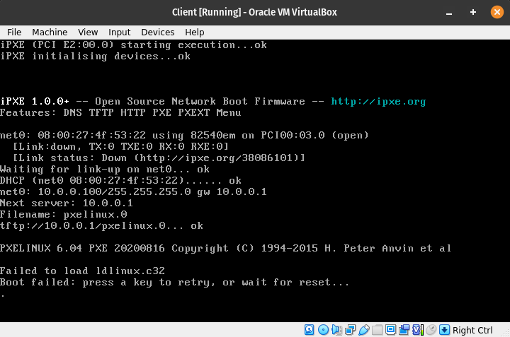
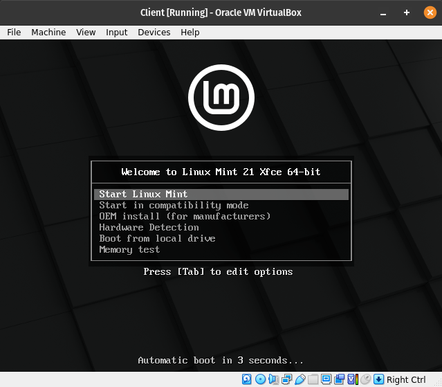

# 4. Lab: Running the bootloader over the network

## Instructions

0. Use the network and virtual machines from the previous labs.
1. Install or customize a DHCP server for running the bootloader over the network?
2. Install or customize a TFTP server for running the bootloader over the network?
3. Prepare the bootloader with the associated files in the folder served by the TFTP server.
4. Start the client virtual machine in network boot mode and have it acquire and run the bootloader over the network.

## Additional information

Booting the Linux operating system has the following steps:

### Booting with BIOS

**1. Physical power-on:** After pressing the power button, the [CPU](https://en.wikipedia.org/wiki/Central_processing_unit) starts at a predefined address (the reset vector; on [x86](https://en.wikipedia.org/wiki/X86) processors typically `0xFFFFFFF0`, for both 32-bit and 64-bit variants).

**2. Hardware initialization:** The [Basic Input/Output System (BIOS)](https://en.wikipedia.org/wiki/BIOS), located in separate memory ([Read-Only Memory – ROM](https://en.wikipedia.org/wiki/Read-only_memory)) on the motherboard, performs the [Power-On Self-Test (POST)](https://en.wikipedia.org/wiki/Power-on_self_test) which detects, initializes, and tests hardware such as the CPU, RAM, GPU, hard drives, and other I/O devices, then brings them up. If present, [BIOS extensions](https://en.wikipedia.org/wiki/BIOS#Extensions_%28option_ROMs%29) run as well, allowing execution of code stored in option ROMs on expansion cards to initialize devices such as NICs, disk controllers, graphics accelerators, and others.

**3. Boot device selection:** Based on the configured boot order, the BIOS loads the [Master Boot Record (MBR)](https://en.wikipedia.org/wiki/Master_boot_record) (the first 512 B) from the chosen disk to `0x7C00` and jumps there.

MBR structure:

- 446 B boot code,
- 64 B (4×16 B) partition table,
- 2 B signature `0x55AA`.

**4. Bootloader:** The boot code or [bootloader](https://en.wikipedia.org/wiki/Bootloader) in the MBR starts the OS in one or more stages. Stage 1 in the MBR is very small; it loads stage 1.5 (in the post-MBR area or in the `BIOS Boot` partition for [GUID Partition Table (GPT)](https://en.wikipedia.org/wiki/GUID_Partition_Table)) and then stage 2 as a file from the `/boot` directory.

**5. Loading the kernel:** The bootloader’s stage 2 loads the Linux [kernel (vmlinuz)](https://en.wikipedia.org/wiki/Linux_kernel) and the [initial RAM disk (initramfs, formerly initrd)](https://en.wikipedia.org/wiki/Initial_ramdisk), and passes kernel parameters.

### Booting with UEFI

**1. Physical power-on & 2. Hardware initialization:** Proceed similarly, but using the [Unified Extensible Firmware Interface (UEFI)](https://en.wikipedia.org/wiki/UEFI) instead of BIOS (UEFI phases SEC/PEI/DXE, UEFI extensions, UEFI drivers).

**3. Boot device selection:** UEFI uses [NVRAM](https://wikileaks.org/ciav7p1/cms/page_26968097.html) entries (`BootOrder`, `Boot####`) and loads an EFI application (`*.efi`) from the ESP – EFI System Partition (FAT32, typically 100–512 MiB).

**4. Bootloader:** The bootloader is an EFI application on the ESP (e.g., GRUB EFI, systemd-boot, rEFInd, Limine) or the kernel is booted directly (EFI-stub/direct boot). Secure Boot is possible (e.g., via shim).

**5. Loading the kernel:** The bootloader or UEFI (direct) loads the kernel and initramfs, passes the cmdline, and provides the UEFI memory map/hand-off. With Secure Boot, the signature chain can extend to the kernel (and often the initramfs).

### What Linux does after the kernel loads

**1. Initramfs:** The kernel unpacks the initramfs (a cpio archive in RAM), loads drivers, sets up [`udev`](https://en.wikipedia.org/wiki/Udev), and locates the root filesystem.

**2. Switch to root:** It mounts the root filesystem (e.g., at `/`) and executes `switch_root/pivot_root`. Mounting filesystems into the OS is done with the [`mount`](https://linux.die.net/man/8/mount) command.

**3. PID 1 – init:** It starts [`/sbin/init`](https://en.wikipedia.org/wiki/Init) (most commonly [`systemd`](https://en.wikipedia.org/wiki/Systemd)), which then launches services, sets the [`runlevel`](https://en.wikipedia.org/wiki/Runlevel)/target, the login screen, the graphical environment, etc.

### Network boot and booting from media

**Optical media:** Boot follows the [El Torito](https://en.wikipedia.org/wiki/ISO_9660#El_Torito) standard; the MBR is not used.

**Network boot:** The [Preboot Execution Environment – PXE](https://en.wikipedia.org/wiki/Preboot_Execution_Environment) fetches a boot image via TFTP/HTTP (often PXELINUX or iPXE).

### Common bootloaders
- [GNU GRand Unified Bootloader (GRUB)](https://en.wikipedia.org/wiki/GNU_GRUB) – a powerful open-source bootloader from the GNU project, supporting multiple operating systems and configurations.
- [systemd-boot](https://en.wikipedia.org/wiki/Systemd-boot) – a simple UEFI boot manager (formerly gummiboot) included in `systemd`, enabling selection among installed systems and editing kernel parameters.
- [rEFInd](https://en.wikipedia.org/wiki/REFInd) – a graphical boot manager for UEFI systems, designed for easy selection among multiple OSes; created as a successor to the discontinued rEFIt project.
- [Limine](https://wiki.archlinux.org/title/Limine) – a modern, multi-platform bootloader with BIOS and UEFI support, developed as a reference implementation of the Limine boot protocol; supports booting Linux and chain-loading other bootloaders.
- [SYSLINUX](https://wiki.syslinux.org/wiki/index.php?title=SYSLINUX) – a collection of lightweight bootloaders originally aimed at BIOS/MBR systems. Includes several specialized variants, e.g., [ISOLINUX](https://wiki.syslinux.org/wiki/index.php?title=ISOLINUX) for bootable CD/DVD media (ISO 9660), [PXELINUX](https://wiki.syslinux.org/wiki/index.php?title=PXELINUX) for PXE network boot, and [EXTLINUX/EFILINUX](https://wiki.syslinux.org/wiki/index.php?title=EXTLINUX) for booting from various filesystems (including UEFI support in the EFILINUX module).
- [LILO](https://en.wikipedia.org/wiki/LILO_%28bootloader%29) – an older Linux bootloader for BIOS systems; historically the default in many distributions before the switch to GRUB (LILO development ended in 2015).

## Detailed instructions

### 1. Task

We start the first virtual computer and check the status of both configured network cards with the `ip` command.

    ip a

    1: lo: <LOOPBACK,UP,LOWER_UP> mtu 65536 qdisc noqueue state UNKNOWN group default qlen 1000
        link/loopback 00:00:00:00:00:00 brd 00:00:00:00:00:00
        inet 127.0.0.1/8 scope host lo valid_lft forever preferred_lft forever
        inet6 ::1/128 scope host valid_lft forever preferred_lft forever
    2: enp0s3: <BROADCAST,MULTICAST,UP,LOWER_UP> mtu 1500 qdisc pfifo_fast state UP group default qlen 1000
        link/ether 08:00:27:26:d5:82 brd ff:ff:ff:ff:ff:ff
    3: enp0s8: <BROADCAST,MULTICAST,UP,LOWER_UP> mtu 1500 qdisc pfifo_fast state UP group default qlen 1000
        link/ether 08:00:27:86:d1:5b brd ff:ff:ff:ff:ff:ff
        inet6 fe80::a00:27ff:fe86:d15b/64 scope link noprefixroute valid_lft forever preferred_lft forever

We get the following printout, from which we determine that both network cards did not obtain IP network addresses, which is the result of missing settings and the operation of the `network-manager` program, which manages networks. To continue setting up the network, we will turn off the `network-manager` and prepare the necessary configuration files to achieve the desired operation.

    su -
    systemctl stop NetworkManager.service
    systemctl disable NetworkManager.service

We setup the network cards in the file `/etc/network/interfaces` in such a way that `enp0s3` represents the network card in the `NAT` network, which obtains the network address automatically via DHCP, and `enp0s8` represents the network card in the `Internal network` network, which has a static address because the DHCP server will work through it.

    nano /etc/network/interfaces

    auto enp0s3
    iface enp0s3 inet dhcp

    auto enp0s8
    iface enp0s8 inet static
      address 10.0.0.1
      netmask 255.255.255.0

In order for the settings to be taken into account, we restart the operation of the network cards on the virtual computer.

    systemctl restart networking.service

Now install a DHCP server, for example `isc-dhcp-server`.

    apt update
    apt install isc-dhcp-server

In the `/etc/default/isc-dhcp-server` file, set the network card on which the `isc-dhcp-server` DHCP server should run.

    nano /etc/default/isc-dhcp-server

    INTERFACESv4="enp0s8"

In the `/etc/dhcp/dhcpd.conf` file, we set which network will be managed by the DHCP server, i.e. which IP network addresses will it assign to network devices, the IP address of the main gateway, the [DNS](https://en.wikipedia.org/wiki/Domain_Name_System) server IP address (for example, the public Cloudflare DNS server with the IP address `1.1.1.1`), we set the name of the bootloader that we will offer over the network in the environment [Preboot Execution Environment (PXE) ](https://en.wikipedia.org/wiki/Preboot_Execution_Environment) and the server IP address that provides it.

    nano /etc/dhcp/dhcpd.conf
	
    subnet 10.0.0.0 netmask 255.255.255.0 {
	  range 10.0.0.100 10.0.0.200;
	  option routers 10.0.0.1;
	  option domain-name-servers 1.1.1.1;
      filename "pxelinux.0";
      next-server 10.0.0.1;
	}

For the settings to take effect, restart the `isc-dhcp-server` DHCP server.

    systemctl restart isc-dhcp-server.service

Next, we enable routing by creating a file `/etc/sysctl.d/sysctl.conf` and enable packet routing.

    nano /etc/sysctl.d/sysctl.conf

    net.ipv4.ip_forward=1

To take into account the changes in Linux kernel parameters, use the `sysctl` command.

    sysctl -p /etc/sysctl.d/sysctl.conf

Then we set the IP network address translation. If we do not already have the `iptables` package installed, we install it with the package manager of the operating system.

    apt install iptables

    iptables -t nat -A POSTROUTING -o enp0s3 -j MASQUERADE

	iptables -t nat -L -v

	Chain PREROUTING (policy ACCEPT 2 packets, 1152 bytes)
 	 pkts bytes target     prot opt in     out     source               destination         

	Chain INPUT (policy ACCEPT 0 packets, 0 bytes)
 	 pkts bytes target     prot opt in     out     source               destination         

	Chain OUTPUT (policy ACCEPT 20 packets, 2816 bytes)
 	 pkts bytes target     prot opt in     out     source               destination         

	Chain POSTROUTING (policy ACCEPT 6 packets, 1122 bytes)
 	 pkts bytes target     prot opt in     out     source               destination         
   	   14  1694 MASQUERADE  all  --  any    enp0s3  anywhere             anywhere   

Let's make sure that the rules we enter in `iptables` are preserved by installing `iptables-persistent` and saving them.

    apt install iptables-persistent

	iptables-save > /etc/iptables/rules.v4

### 2. Task

Let's install a TFTP server, for example `tftpd-hpa` package and add the `-v` flag and the `-c` flag in the `/etc/default/tftpd-hpa` configuration file to enable automatic availability of newly added files in the `/srv/tftp` and enable more verbose logging.

    apt install tftpd-hpa

    nano /etc/default/tftpd-hpa

    # /etc/default/tftpd-hpa

    TFTP_USERNAME="tftp"
    TFTP_DIRECTORY="/srv/tftp"
    TFTP_ADDRESS=":69"
    TFTP_OPTIONS="-v -c --secure"

	systemctl restart tftpd-hpa.service

### 3. Task

It we need a system bootloader that allows booting over the network. For example, let's use `pxelinux` by first obtaining it with a package manager and then moving it to `/srv/tftp` to make it accessible via TFTP on the network.

    apt install pxelinux
    cd /srv/tftp
    cp /usr/lib/PXELINUX/pxelinux.0 .

### 4. Task

We set the second virtual computer to boot over the network by clicking on the `Settings...` button in the menu above and under the tab `System\Motherboard` and the label `Start order:` select `Network` and uncheck all other options.

We now start the second virtual computer and it starts the PXE environment for booting over the network. The virtual machine successfully obtains an IP address from our DHCP server, receives the IP address of the TFTP server, and the name of the bootloader it needs to download. It then successfully downloads the `pxelinux.0` bootloader and runs it. The bootloader stops at the missing `ldlinux.c32` file.

Communication between the server and the client can also be tracked with logs in `/var/log/syslog` that are updated automatically. First we see obtaining an IP address via the DHCP server, then via the TFTP protocol the download of the system loader `pxelinux.0` and then the search for the file `ldlinux.c32` in various places in the file system. Because the `ldlinux.c32` file does not exist, the network boot process fails.

    tail -f /var/log/syslog

    Nov  3 15:27:06 debian dhcpd[679]: DHCPDISCOVER from 08:00:27:4f:53:22 via enp0s8
    Nov  3 15:27:07 debian dhcpd[679]: DHCPOFFER on 10.0.0.100 to 08:00:27:4f:53:22 via enp0s8
    Nov  3 15:27:09 debian dhcpd[679]: reuse_lease: lease age 82 (secs) under 25% threshold, reply with unaltered, existing lease for 10.0.0.100
    Nov  3 15:27:09 debian dhcpd[679]: DHCPREQUEST for 10.0.0.100 (10.0.0.1) from 08:00:27:4f:53:22 via enp0s8
    Nov  3 15:27:09 debian dhcpd[679]: DHCPACK on 10.0.0.100 to 08:00:27:4f:53:22 via enp0s8
    Nov  3 15:27:09 debian in.tftpd[3304]: connect from 10.0.0.100 (10.0.0.100)
    Nov  3 15:27:09 debian tftpd[3305]: tftpd: trying to get file: pxelinux.0
    Nov  3 15:27:09 debian tftpd[3305]: tftpd: serving file from /srv/tftp
    Nov  3 15:27:09 debian in.tftpd[3306]: connect from 10.0.0.100 (10.0.0.100)
    Nov  3 15:27:09 debian tftpd[3307]: tftpd: trying to get file: ldlinux.c32
    Nov  3 15:27:09 debian tftpd[3307]: tftpd: serving file from /srv/tftp
    Nov  3 15:27:09 debian in.tftpd[3308]: connect from 10.0.0.100 (10.0.0.100)
    Nov  3 15:27:09 debian tftpd[3309]: tftpd: trying to get file: /boot/isolinux/ldlinux.c32
    Nov  3 15:27:09 debian in.tftpd[3310]: connect from 10.0.0.100 (10.0.0.100)
    Nov  3 15:27:09 debian tftpd[3311]: tftpd: trying to get file: /isolinux/ldlinux.c32
    Nov  3 15:27:09 debian in.tftpd[3312]: connect from 10.0.0.100 (10.0.0.100)
    Nov  3 15:27:09 debian tftpd[3313]: tftpd: trying to get file: /boot/syslinux/ldlinux.c32
    Nov  3 15:27:09 debian in.tftpd[3314]: connect from 10.0.0.100 (10.0.0.100)
    Nov  3 15:27:09 debian tftpd[3315]: tftpd: trying to get file: /syslinux/ldlinux.c32
    Nov  3 15:27:09 debian in.tftpd[3316]: connect from 10.0.0.100 (10.0.0.100)
    Nov  3 15:27:09 debian tftpd[3317]: tftpd: trying to get file: /ldlinux.c32

In newer versions of the Linux operating system, events are recorded in 'systemd' logs, which are accessed via the `journalctl` command. The `-u` flag enables following of the events of only a particular program, and the `-f` flag allows us to automatically display new records.

    journalctl -u tftpd-hpa.service -f

    Oct 31 19:18:18 debian systemd[1]: Starting tftpd-hpa.service - LSB: HPA's tftp server...
    Oct 31 19:18:18 debian tftpd-hpa[786]: Starting HPA's tftpd: in.tftpd.
    Oct 31 19:18:18 debian systemd[1]: Started tftpd-hpa.service - LSB: HPA's tftp server.
    Oct 31 19:34:02 debian in.tftpd[2776]: RRQ from 10.0.1.100 filename pxelinux.0
    Oct 31 19:34:02 debian in.tftpd[2777]: RRQ from 10.0.1.100 filename ldlinux.c32
    Oct 31 19:34:02 debian in.tftpd[2777]: sending NAK (1, File not found) to 10.0.1.100
    Oct 31 19:34:02 debian in.tftpd[2778]: RRQ from 10.0.1.100 filename /boot/isolinux/ldlinux.c32
    Oct 31 19:34:02 debian in.tftpd[2778]: sending NAK (1, File not found) to 10.0.1.100
    Oct 31 19:34:02 debian in.tftpd[2779]: RRQ from 10.0.1.100 filename /isolinux/ldlinux.c32
    Oct 31 19:34:02 debian in.tftpd[2779]: sending NAK (1, File not found) to 10.0.1.100
    Oct 31 19:34:02 debian in.tftpd[2780]: RRQ from 10.0.1.100 filename /boot/syslinux/ldlinux.c32
    Oct 31 19:34:02 debian in.tftpd[2780]: sending NAK (1, File not found) to 10.0.1.100
    Oct 31 19:34:02 debian in.tftpd[2781]: RRQ from 10.0.1.100 filename /syslinux/ldlinux.c32
    Oct 31 19:34:02 debian in.tftpd[2781]: sending NAK (1, File not found) to 10.0.1.100
    Oct 31 19:34:02 debian in.tftpd[2782]: RRQ from 10.0.1.100 filename /ldlinux.c32
    Oct 31 19:34:02 debian in.tftpd[2782]: sending NAK (1, File not found) to 10.0.1.100

The missing file is part of the modules needed to run the bootloader, which also needs a configuration file. The easiest way to get to the files is to take the installation image of a Linux distribution that uses the `isolinux` bootloader and copy them to the `/srv/tftp` folder. Later, we will use the rest of the files to successfully boot the operating system. For example, we download the installation image of the distribution [Mint](https://linuxmint.com/download.php) and insert it into the first virtual machine by selecting it in the menu `Devices\Optical drives\Select disk file ...`. The image is now inserted and we access it via `/dev/sr0`, to access the files, we still have to mount it with the `mount` command in any empty folder.

    mount /dev/sr0 /mnt

Download the missing files from the `isolinux` folder on the attached installation image.

    cp /mnt/isolinux/ldlinux.c32 .
    cp /mnt/isolinux/libutil.c32 .
    cp /mnt/isolinux/vesamenu.c32 .
    cp /mnt/isolinux/libcom32.c32 .
    cp /mnt/isolinux/splash.png .
	cp /mnt/isolinux/live.cfg .

We still lack the system loader configuration file, for which we can use the `isolinux.cfg` and `live.cfg` files from the installation image. The `pxelinux` system loader can offer several configuration files at the same time, which are stored in the `pxelinux.cfg` folder and we transfer `isolinux.cfg` to it and rename it to `default`.

    mkdir pxelinux.cfg
    cp /mnt/isolinux/isolinux.cfg ./pxelinux.cfg/default

Now we restart the second virtual machine which successfully starts the bootloader with the given settings.

