# 1. Vaja: Virtualizacija in nastavitev omrežja

## Navodila

1. Namestite poljuben hipernadzornik za virtualizacijo, na primer [VirtualBox](https://www.virtualbox.org/).
2. V virtualno računalnik namestite poljubno distribucijo Linux operacijskega sistema, na primer [Debian](https://www.debian.org/).
3. S kloniranjem virtualnega računalnika postavite še en virtualni računalnik.
4. Poskrbite, da se virtualna računalnika lahko povezujeta preko omrežja, z uporabo Omrežja NAT, Notranjega omrežja in Povezanega vmesnika.

## Dodatne informacije

Pogosto uporabljani hipernadzorniki:

- [Oracle VirtualBox](https://www.virtualbox.org/)
- [VMware Workstation Player](https://www.vmware.com/products/workstation-player.html)
- [GNS3](https://www.gns3.com/) 
- [QEMU](https://www.qemu.org/)
- [Hyper-V](https://learn.microsoft.com/en-us/virtualization/hyper-v-on-windows/)

Pomembni rezervirani bloki naslovov v omrežju Internet:

| Omrežni blok   | Interval                      | Št. naslovov | Opis                        |
|----------------|-------------------------------|--------------|-----------------------------|
| 10.0.0.0/8     | 10.0.0.0 - 10.255.255.255     | 16.777.216   | Lokalni naslovi             |
| 127.0.0.0/8    | 127.0.0.0 - 127.255.255.255   | 16.777.216   | Povratni naslovi            |
| 169.254.0.0/16 | 169.254.0.0 - 169.254.255.255 | 65.536       | Naslovi za lokalno povezavo |
| 172.16.0.0/12  | 172.16.0.0 - 172.31.255.255   | 1.048.576    | Lokalni naslovi             |
| 192.168.0.0/16 | 192.168.0.0 - 192.168.255.255 | 65.536       | Lokalni naslovi             |
| 224.0.0.0/4    | 224.0.0.0 - 239.255.255.255   | 268435456    | Naslovi za razpošiljanje    |

Ukaz [`ip`](https://linux.die.net/man/8/ip) nam omogoča prikaz ter upravljanje z omrežnimi napravami, omrežnimi karticami, tuneli in usmerjanjem.

Ukaz [`ping`](https://linux.die.net/man/8/ping) nam omogoča pošiljanje ICMP ECHO_REQUEST paketkov izbrani omrežni napravi na podlagi njegovega IP naslova.

Ukaz [`apt-get`](https://linux.die.net/man/8/apt-get) je upravljalec paketov, ki nam omogoča namestitev, spreminjanje in brisanje programov ter iskanje programske opreme po dostopnih repozitorijih.

## Podrobna navodila

### 1. Naloga

Na operacijskih sistemih Windows in MacOS namestite hipernadzornik VirtualBox, tako da prenesete namestitveno datoteke z uradne [spletne strani](https://www.virtualbox.org/) in sledite navodilom med namestitvijo. Na operacijskem sistemu Linux, pa namestite VirtualBox iz repozitorijev vaše distribucije. Na distribucijah, ki so osnovane Debian-u to storimo z upravljalcem paketov `apt`.

    apt install virtualbox

### 2. Naloga

Po uspešni namestitvi odpremo VirtualBox in v meniju zgoraj izberemo možnost `Nov ...` in tako odpremo čarovnika za ustvarjanje novih virtualnih računalnikov. V prvem oknu določimo `Ime`, `Mapo računalnika`, `Tip` in `Verzijo` novega virtualnega računalnika. Na primer, za ime izberemo `Debian`, za mapo v katerem bo shranjen navidezni računalnik izberemo `/home/USER/VirtualBox VMs`, za tip izberemo `Linux` in za verzijo pa `Debian (64-bit)`. Pritisnemo gumb `Naprej`.

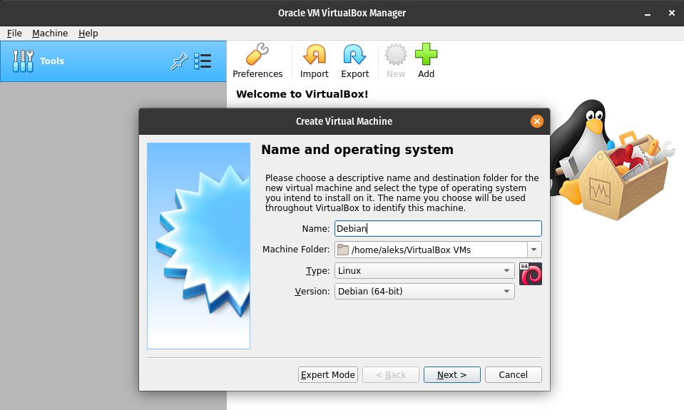

V drugem oknu določimo količino pomnilnika (RAM-a), ki ga bomo namenili našemu navideznemu računalniku. Na primer, določimo `2042 MB` pomnilnika ter pritisnemo gumb `Naprej`.

V tretjem oknu določimo navidezni trdi disk, in sicer lahko izbiramo med tremi možnostmi: `Ne dodaj navideznega trdega diska`, `Ustvari navidezni trdi disk zdaj` in `Uporabi obstoječo datoteko navideznega trdega diska`. Na primer izberemo, da bomo ustvarili nov navidezni trdi disk za naš nov navidezni računalnik ter pritisnemo gumb `Ustvari`.

V četrtem oknu določimo format navideznega trdega diska, ki ga bo uporabljal naš navidezni računalnik. Na voljo imamo tri možnosti: `VDI (ODtis diska VirtualBox - angl. VirtualBox Disk Image)`, `VHD (navidezni trdi disk - angl. Virtual Hard Disk)` in `VMDK (disk navideznega računalnika - angl. Virtual Machine Disk)`. Na primer, izberemo format `VDI` in pritisnemo gumb `Naprej`.

V petem oknu določimo način dodeljevanja prostora navideznemu trdemu disku, ki je lahko `Dinamično dodeljeno` ali `Nespremenljiva velikost`. Na primer, izberemo dinamično dodeljevanje in pritisnemo gumb `Naprej`.

V šestem oknu določimo kje v datotečnem sistemu se bo ustvaril naš novi navidezni trdi disk in kolikšna bo njegova maksimalna velikost. Na primer, izberemo `/home/USER/VirtualBox VMs/Debian/Debian.vdi` za lokacijo našega navideznega diska ter nastavimo njegovo maksimalno velikost na `30,00 GB`. Pritisnemo gumb `Ustvari`.

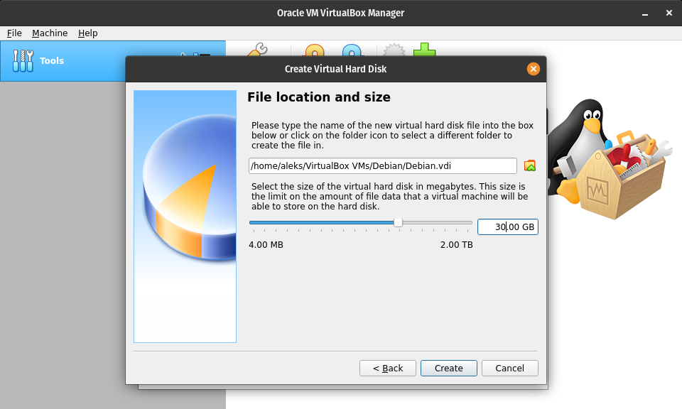

Če smo uspešno ustvarili naš navidezni računalnik `Debian`, se je le ta pojavil v stolpcu na levi strani okna VirtualBox-a. V stolpcu na desni strani pa se nam izpišejo podrobne nastavitve, ki smo jih določili med kreiranjem ali pa so se pred nastavile na privzete vrednosti avtomatsko. 

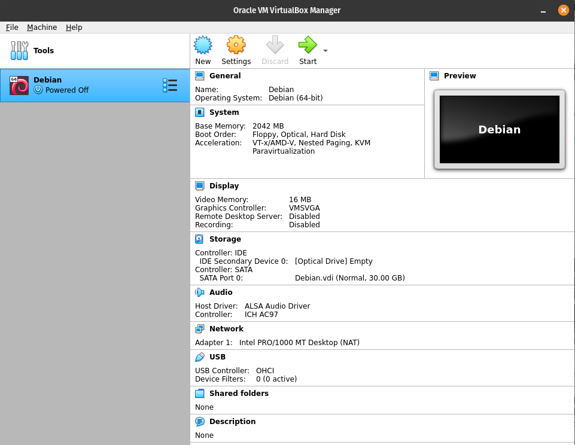

Pred prvim zagonom lahko še bolj natančno nastavimo parametre našega navideznega računalnika, tako da kliknemo na gumb `Nastavitve ...` v meniju zgoraj. Na primer, pod zavihkom `Sistem\Procesor` lahko nastavimo število procesorskih jeder, ki jih dodelimo našemu virtualnemu računalniku.

Sedaj smo končali z nastavitvami našega novega virtualnega računalnika in ga lahko poženemo s pritiskom na gumb `Zaženi`. Ob prvem zagonu se nam avtomatsko prikaže okno za izbiro namestitvene slike operacijskega sistema, ki ga želimo namestiti (npr. [Debian](https://cdimage.debian.org/cdimage/unofficial/non-free/cd-including-firmware/11.5.0+nonfree/amd64/iso-cd/)). Namestitveno sliko operacijskega sistema, ki se nahaja na disku lahko izberemo s klikom na gumb z ikono rumene mape z zeleno puščico. Drugače pa lahko do izbire namestitvene slike operacijskega sistema pridemo tudi če gremo v oknu našega navideznega računalnika v meni `Naprave\Optični pogoni\Izberi datoteko diska ...`.

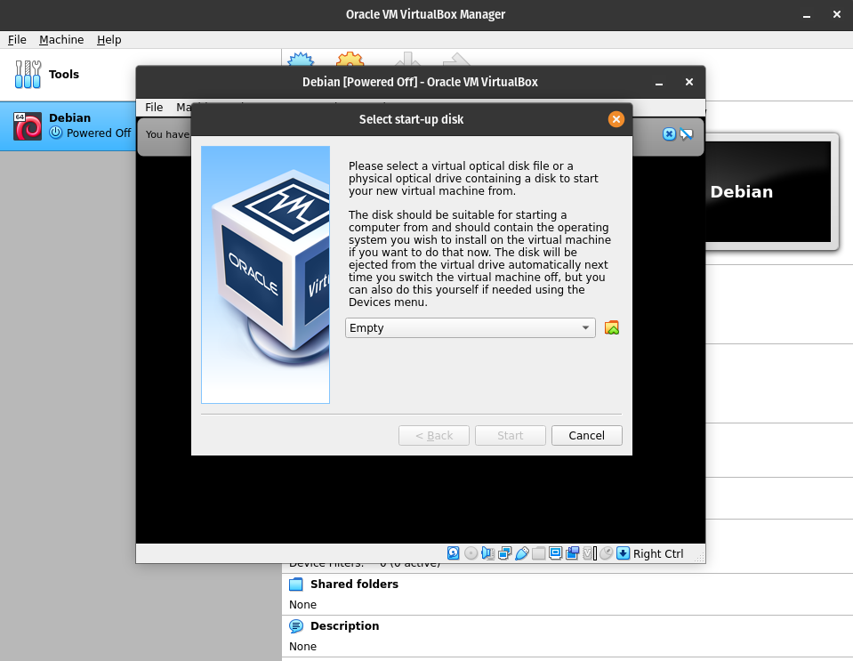

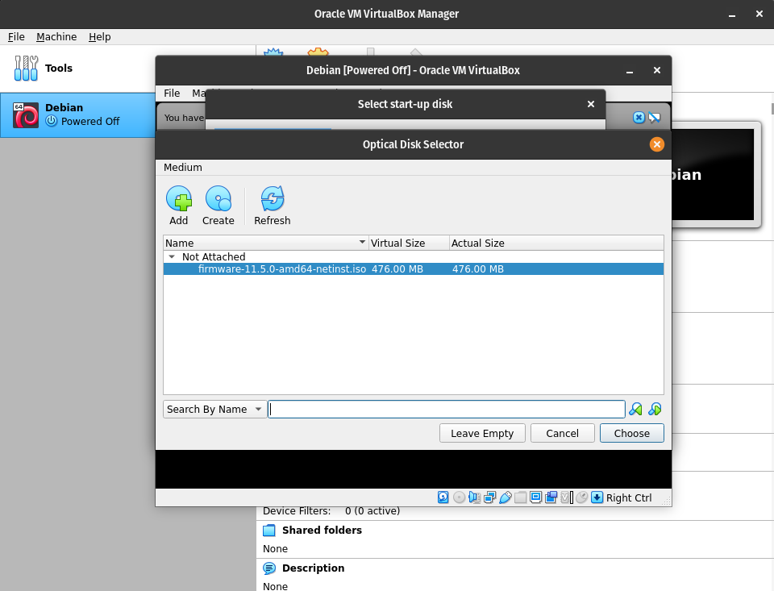

Sedaj se nam pojavi okno zagonskega nalagalnika v katerem lahko izberemo med `Grafična namestitev` in navadno `Namestitev`. Na primer se odločimo za `Grafična namestitev` in pritisnemo tipko `Enter` na tipkovnici.

V naslednjem koraku lahko izberemo poljuben jezik v katerem se bo izvedela namestitev. Na primer izberemo `English` ali `Slovenian` in pritisnemo gumb `Continue`.

Sedaj izberemo kje se nahajamo. Na primer, do Slovenije pridemo tako da izberemo `other\Europe\Slovenia` in pritisnemo gumb `Continue`.

Nato izberemo lokalizacijo. Na primer, izberemo `United States - en_US.UTF-8` in pritisnemo gumb `Continue`.

Sedaj izberemo razporeditev tipkovnice. Na primer, izberemo `Slovenian` in pritisnemo gumb `Continue`. 

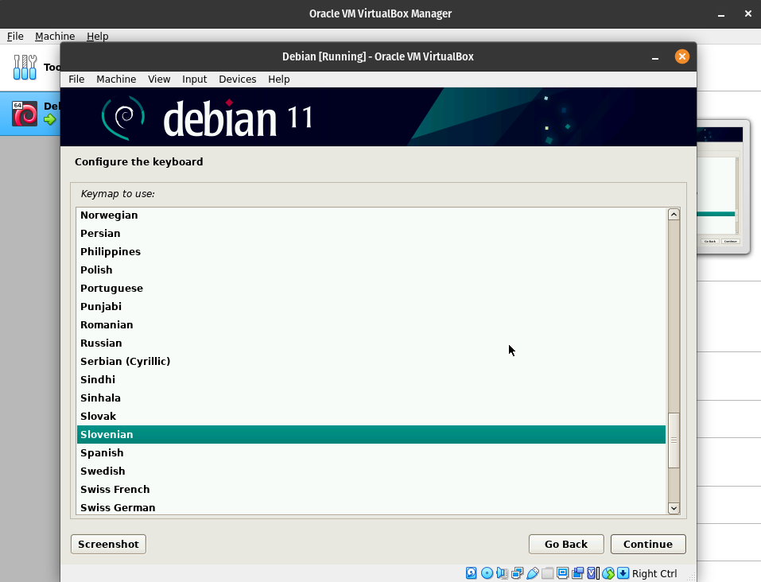

V naslednjem koraku določimo ime našega navideznega računalnika. Uporabimo lahko kar privzeto ime `debian` in pritisnemo gumb `Continue`.

Nato lahko izberemo omrežno domeno, katere del bo naš navidezni računalnik. Zaenkrat je ne potrebujemo zato pustimo polje prazno in pritisnemo gumb `Continue`. 

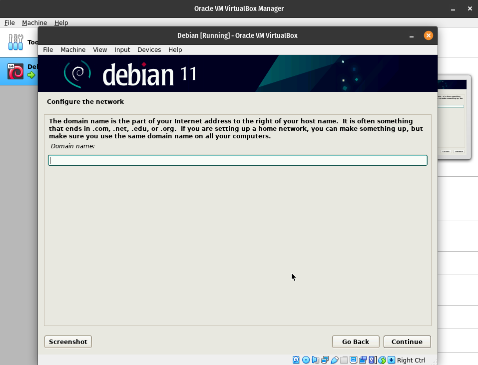

Sedaj v obe polji vnesemo poljubno geslo administratorja (`root`) in pritisnemo gumb `Continue`. 

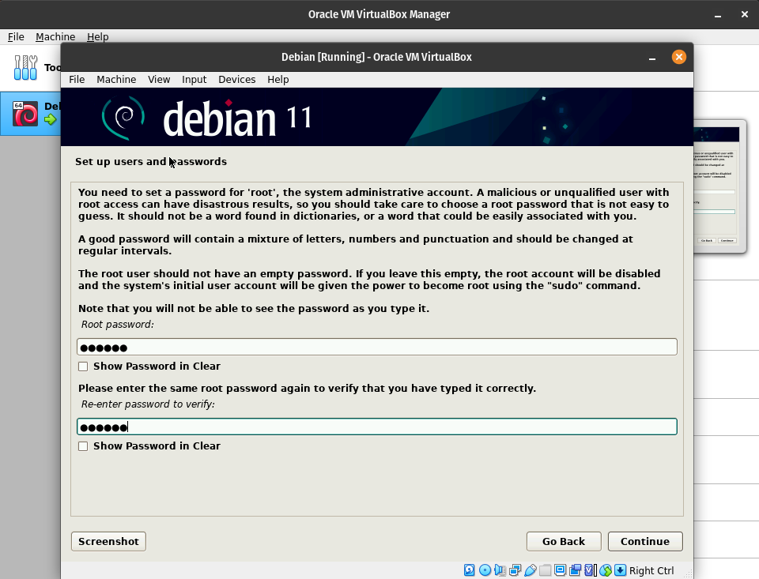

Sledi izbira imena novega uporabnika, za katerega si lahko ime poljubno izberemo in pritisnemo gumb `Continue`. 

Nato določimo še poljubno uporabniško ime novega uporabnika in pritisnemo gumb `Continue`. 

Na koncu še v obe polji vnesem poljubno geslo novega uporabnika in pritisnemo gumb `Continue`.

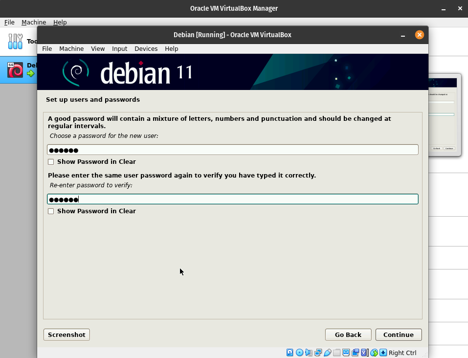

V naslednjem koraku izberemo diske in nastavimo razdelke, kjer lahko izberemo kar privzeto nastavitev `Guided - use entire disk`, ki bo uporabila celoten disk in pritisnemo gumb `Continue`.

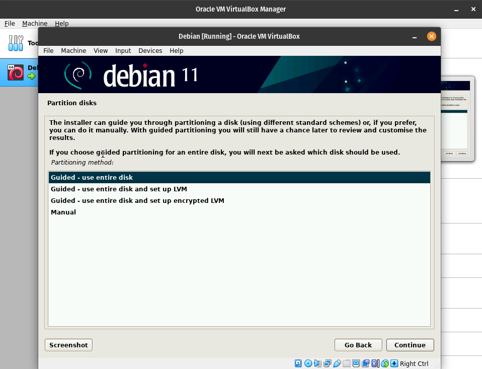

Sedaj izberemo disk na katerega želimo namestiti naš operacijski sistem. V našem primeru izberemo edini virtualni disk, ki ga imamo in pritisnemo gumb `Continue`.

Sledi določitev razdelkov na našem disku, kjer za naše potrebe zadostuje en razdelek v kateremu shranimo vse `All files in one partition (recommended for new users)` in pritisnemo gumb `Continue`.

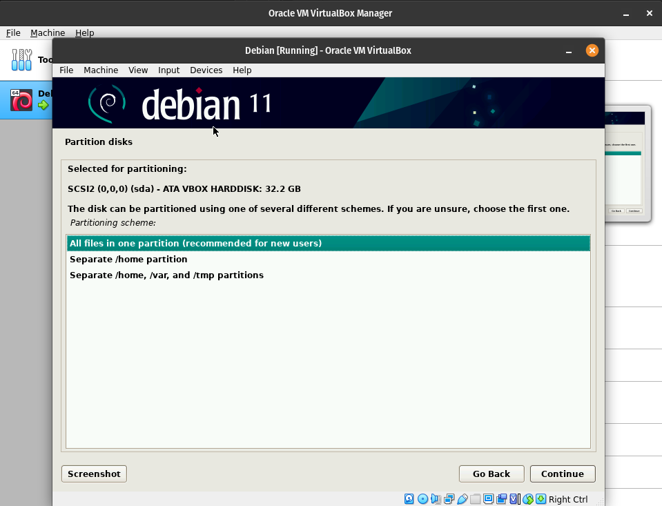

Nato se nam izpišejo trenutno določeni razdelki, ki jih bomo uporabili in možnost za ročno nastavitev le teh. Privzeta nastavitev nam določi dva razdelka in sicer: primarni razdelek za hranjenje podatkov z datotečnim sistemom EXT4 ([Fourth extended file system](https://en.wikipedia.org/wiki/Ext4)) in logični razdelek za razširitev pomnilnika sistema. Predlagane razdelke potrdimo da izberemo `Finish partitioning and write changes to disk` in pritisnemo gumb `Continue`.

Sledi še potrditev izbranih razdelkov, saj se na tem mestu izbrišejo razdelki in podatki, ki so bili predhodno zapisani na disku. Izberemo `Yes`, da se strinjamo s spremembo in pritisnemo gumb `Continue` ter tako začnemo z namestitvijo operacijskega sistema.

Med namestitvijo zavrnemo namestitev dodatnih programov z drugih medijev tako da izberemo možnost `No` in pritisnemo gumb `Continue`.

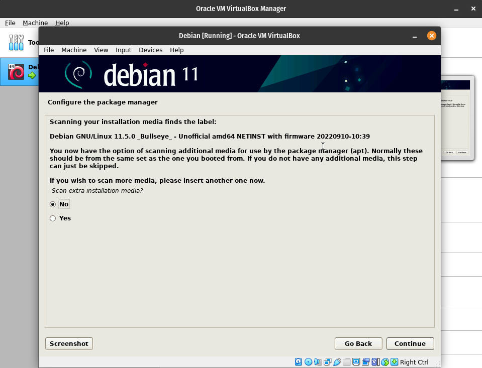

Sedaj izberemo državo v kateri želimo imeti strežnik katerega bo uporabljal upravljalec paketov za namestitev programov. Dobro praksa je, da izberemo državo, ki je blizu naše lokacije, na primer `Slovenia` in pritisnemo gumb `Continue`.

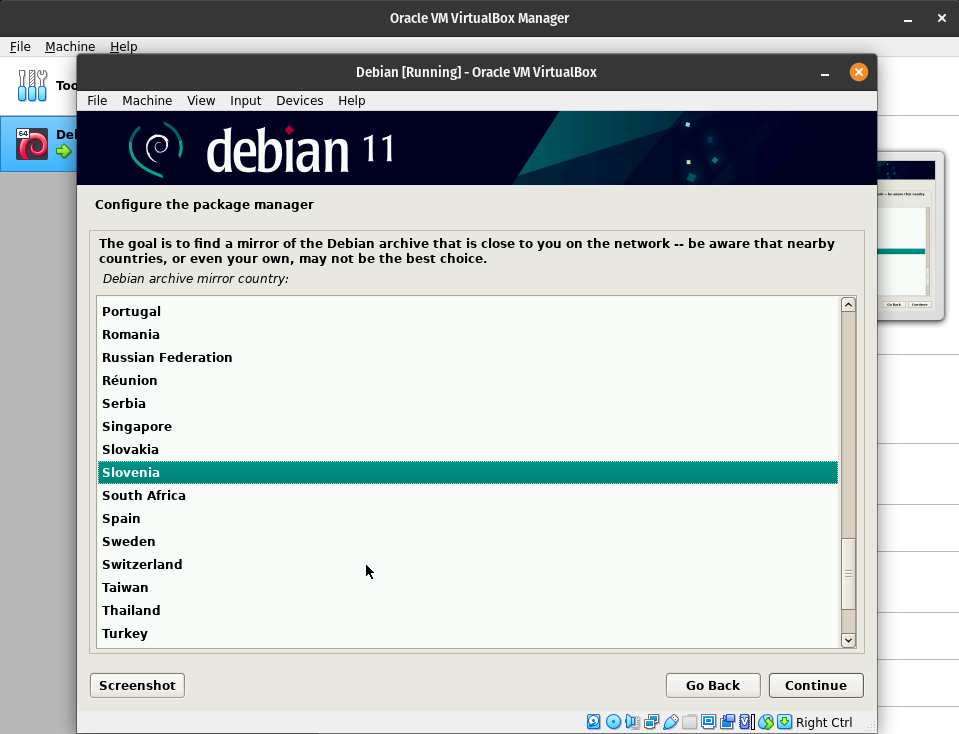

V naslednjem koraku izbiramo med ponujenimi strežniki v izbrani državi za namestitev programov. Lahko pustimo označeno kar privzeto možnosti, ki je `deb.debian.org` in pritisnemo gumb `Continue`.

Namestitev nam omogoča tudi nastavitev posredniškega strežnika (proxy) za dostop do spleta, vendar ga za enkrat ne potrebujemo, zato pustimo polje prazno in pritisnemo gumb `Continue`.

Nato onemogočimo pošiljanje anonimnih podatkov o naši uporabi operacijskega sistema strežnikom Debian tako, da izberemo možnost `No` in pritisnemo gumb `Continue`.

V naslednjem koraku izberemo grafično okolje, ki ga želimo uporabljati in lahko tudi nekaj dodatne programske opreme. Na primer, bomo uporabili kar privzete vrednosti, kjer imamo izbrane naslednje možnosti `Debian desktop environment`, `GNOME` in `standard system utilities` ter nato pritisnemo gumb `Continue`, da nadaljujemo z namestitvijo.

Sedaj še namestimo zagonski nalagalnik (boot loader), ki poskrbi za zagon operacijskega sistema. Izberemo možnost `Yes` in pritisnemo gumb `Continue`.

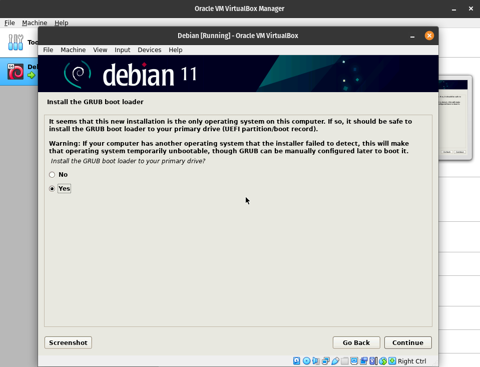

Nato pa še izberemo disk na katerega namestimo zagonski nalagalnik. Izberemo naš edini disk za namestitev tako da izberemo `/dev/sda (HARD_DISK_ID)` in pritisnemo gumb `Continue`.

Uspešno smo namestili operacijski sistem Debian in sedaj ponovno zaženemo naš navidezni računalnik tako pritisnemo gumb `Continue`.

Po ponovnem zagonu se vpišemo v operacijski sistem in preskusimo delovanje operacijskega sistema in spleta.

Dodatno lahko namestimo tudi `VirtualBox Guest Additions`, ki nam omogočajo avtomatsko prilagajanja resolucijo namizja trenutni velikosti okna, kopiranje iz fizičnega v navidezni računalnik in obratno ter še kopico ostalih uporabnih funkcionalnosti. Namestitev začnemo s posodobitvijo repozitorijev našega operacijskega sistema in nato namestimo pakete, ki jih potrebujemo preden začnemo z namestitvijo.

    su -

    apt update

    apt install build-essential dkms linux-headers-$(uname -r)

Sedaj vstavimo namestitveno sliko `VirtualBox Guest Additions`, tako da v oknu navideznega računalnika izberemo `Naprave\Vstavi odtis CD Guest Additions ...`. V primeru, da namestitvene slike še nimamo, nam VirtualBox ponudi, da jo prenesemo, tako da potrdimo prenos s spleta s pritiskom na gumb `Prenos` dvakrat in nato še enkrat na gumb `Vstavi`.

V primeru uspešne vstavitve namestitvene slike `VirtualBox Guest Additions` jo sedaj še priključimo operacijskemu sistemu.

    mkdir -p /mnt/cdrom

    mount /dev/cdrom /mnt/cdrom

    cd /mnt/cdrom

Nato poženemo namestitveni program in po uspešni namestitvi še ponovno zaženemo naš navidezni računalnik.

    sh ./VBoxLinuxAdditions.run --nox11

    shutdown -r now

### 3. Naloga

Najlažje dobimo uporabno kopijo navideznega računalnika dobimo s postopkom kloniranja. Izvedemo ga tako, da z desnim klikom na navidezni računalnik v levem stolpcu v glavnem oknu VirtualBox-a opremo dodatni meni in kliknemo na možnost `Kloniraj ...`. Odpre se nam okno za izbiro nastavitev kloniranja. Določimo lahko `Ime`, `Mapo računanika`, `Upravljanje z MAC naslovi` in `Dodatne možnosti`. `Upravljanje z MAC naslovi` nam omogoča, da `Vključimo MAC naslove vseh omrežnih kartic` (angl. Include all network adapter MAC addresses), da `Vključimo MAC naslove omrežnih kartic ki imajo omrežje nastavljeno na NAT` (angl. Include only NAT network adapter MAC addresses) ali pa `Ustvarimo nove MAC naslove za vse omrežne kartice ne glede na nastavitve` (angl. Generate new MAC addresses for all network adapters). Na primer, za ime izberemo `Debian Clone`, za mapo v katerem bo shranjen navidezni računalnik izberemo `/home/USER/VirtualBox VMs`, izberemo, da ustvarimo nove MAC naslove za vse omrežne kartice ne glede na nastavitve in pustimo dodatne možnosti odkljukane. Pritisnemo gumb `Naprej`.

V naslednjem koraku izbiramo med načinom kloniranjem `Poln klon` in `Povezan klon`. Poln klon podvoji vse datoteke navideznega računalnika, medtem ko povezani klon ohrani enake datoteke navideznih računalnikov v skupnih datotekah. Ostale datoteke, ki pa se razlikujejo, pa shrani v datotekah, ki so specifične vsakemu posameznemu navideznemu računalniku. Povezan klon nam zavzame manj prostora na disku v primerjavi s polnim klonom. Po drugi strani pa na polni klon klon omogoča hitrejše dostop do datotek, saj so neodvisno zapisane na disku, pri povezanem klonu pa več navideznih računalnikov hkrati dostopa do istih datotek na disku, kar lahko upočasni dostop. Povezani kloni so odvisni med seboj, kar lahko privede do nepredvidenih sprememb v skupnih podatkih in posledično so poškodovanih datotek. V naše primeru izberemo možnost `Poln klon` in pritisnemo gumb `Kloniraj`, da pričnemo s kloniranjem.

### 4. Naloga

Spodaj predstavimo štiri možne nastavitve omrežja, ki nam vsaj delno omogočajo povezavo preko omrežja med več navideznimi računalniki.

Pod zavihkom `Omrežje` lahko dodelimo do štiri `Vmesnike` našemu virtualnemu računalniku. Na primer, `Vmesnik 1` vsem našim navideznim računalnikom nastavimo na `NAT`, `Notranje omrežje`, `Povezan vmesnik` ali `Omrežje NAT`.

Možnost `NAT` nam nastavi preslikovanje IP naslovov iz omrežja našega fizičnega računalnika v omrežje našega navideznega računalnika s spreminjanjem IP naslovov v glavah IP paketov ([NAT - Network address translation](https://en.wikipedia.org/wiki/Network_address_translation)). V tem primeru ima naš navidezni računalnik privzeto svoje omrežje in ne more direktno dostopati do drugih navideznih računalnikov, našega fizičnega računalnika in fizičnega omrežja. Pogojno lahko omogočimo dostop za določene aplikacije preko odpiranja določenih omrežnih vrat (port forwarding), ki jih nastavljamo tako da kliknemo na zavihek `Napredno` in nato kliknemo na gumb `Posredovanje vrat`. Posamezna vrata odpremo, tako da nastavimo `Ime`, `Protokol`, `IP gostitelja`, `Vrata gostitelja`, `IP gosta` in `Vrata gosta`.

Možnost `Notranje omrežje` nam poveže več navideznih računalnikov v omrežje brez usmerjevalnika, kjer morajo sami poskrbeti za vzpostavitev IP naslovov. Navidezni računalnik se po pravilni nastavitvi omrežja vidijo med seboj, vendar nimajo dostopa do spleta in drugih omrežij, razen če en navidezni računalnik deluje tudi kot usmerjevalnik. 

IP naslov lahko na obeh navideznih računalnikih nastavimo z ukazom `ip`, kjer pravilno nastavimo IP naslova, omrežno masko ter omrežni kartici, da omogočimo povezljivost.

Na prvem navideznem računalniku z omrežno kartico `enp0s3` nastavimo omrežni IP naslov na primer na `192.168.1.1/24`.

    ip addr add 192.168.1.1/24 dev enp0s3

Na drugem navideznem računalniku z omrežno kartico `enp0s3` nastavimo omrežni IP naslov v istem omrežju kot pri prvemu navideznemu računalniku, na primer na `192.168.1.2/24`.

    ip addr add 192.168.1.2/24 dev enp0s3

Možnost `Povezan vmesnik` nam nastavi deljenje omrežnega vmesnika našega fizičnega računalnik z navideznim računalnikom, tako da oba pridobita IP naslov iz fizičnega omrežja. Naš navidezni računalnik deluje, kot da je priključen v fizično omrežje in ima privzeto dostop do vsem računalnikov v tem omrežju.

Možnost `Omrežje NAT` nastavi prav tako preslikovanje IP naslovov iz omrežja našega fizičnega računalnika v navidezno omrežje v katerega se lahko poveže več navideznih računalnikov. V tem primeru ima naš navidezni računalnik privzeto dostop do vseh navideznih računalnikov povezanih v NAT omrežje, ki je definirano z imenom, vendar nima direktnega dostopa preko omrežja do našega fizičnega računalnika in fizičnega omrežja. Pogojno lahko omogočimo dostop do fizičnega omrežja za določene aplikacije preko odpiranja določenih omrežnih vrat (port forwarding).

Če izberemo možnost `Omrežje NAT`, nam to privzeto ne bo delovalo, saj ga moramo predhodno ustvariti. To storimo tako da v glavnem oknu VirtualBox-a izberemo meni `Datoteka\Možnosti ...`. Pod zavihkom `Omrežje` nato kliknemo na gumb z ikono omrežnega vmesnika in z zelenim simbolom za plus in ustvarimo novo NAT omrežje z imenom `NatNetwork`.

Privzete vrednosti NAT omrežja zadostujejo za naše potrebe, lahko pa jih spremenimo tako, da izberemo željeno NAT omrežje in kliknemo na gumb z ikono omrežnega vmesnika in z oranžnim simbolom za zobnik. Prav tako lahko odpiramo vrata za celotno NAT omrežje. Izbrano NAT omrežje lahko tudi izbrišemo, tako da pritisnemo na gumb z ikono omrežnega vmesnika in z rdečim simbolom za križ.

Če uporabljamo VirtualBox od verzije 7.0 naprej potem upravljamo z omrežjem NAT, tako da izberemo meni `Datoteka\Orodja\Upravitelj Omrežij` in nato izberemo zavihek `Omrežja NAT`.

Sedaj se lahko vrnemo v nastavitve našega navideznega računalnika, tako da kliknemo na gumb `Nastavitve ...` v meniju zgoraj. Nato v zavihku `Omrežje` izberemo da `Vmesnik 1` uporablja skupno `Omrežje NAT` z imenom `NatNetwork`, ki smo ga predhodno ustvarili.

IP naslove v posameznih navideznih računalnikih lahko preverimo z ukazom `ip`.

    ip a

    1: lo: <LOOPBACK,UP,LOWER_UP> mtu 65536 qdisc noqueue state UNKNOWN group default qlen 1000
    link/loopback 00:00:00:00:00:00 brd 00:00:00:00:00:00
    inet 127.0.0.1/8 scope host lo
       valid_lft forever preferred_lft forever
    inet6 ::1/128 scope host 
       valid_lft forever preferred_lft forever
    2: enp0s3: <BROADCAST,MULTICAST,UP,LOWER_UP> mtu 1500 qdisc pfifo_fast state UP group default qlen 1000
    link/ether 08:00:27:40:07:ad brd ff:ff:ff:ff:ff:ff
    inet 10.0.2.15/24 brd 10.0.2.255 scope global dynamic noprefixroute enp0s3
       valid_lft 85104sec preferred_lft 85104sec
    inet6 fe80::a00:27ff:fe40:7ad/64 scope link noprefixroute 
       valid_lft forever preferred_lft forever

Povezljivost med posameznima navideznima računalnikoma preko  omrežja lahko preverimo z ukazom `ping`.

    ping 10.0.2.15 -c 4

    PING 10.0.2.15 (10.0.2.15) 56(84) bytes of data.
    64 bytes from 10.0.2.15: icmp_seq=1 ttl=64 time=0.691 ms
    64 bytes from 10.0.2.15: icmp_seq=2 ttl=64 time=1.44 ms
    64 bytes from 10.0.2.15: icmp_seq=3 ttl=64 time=4.03 ms
    64 bytes from 10.0.2.15: icmp_seq=4 ttl=64 time=0.538 ms

    --- 10.0.2.15 ping statistics ---
    4 packets transmitted, 4 received, 0% packet loss, time 3027ms
    rtt min/avg/max/mdev = 0.538/1.676/4.034/1.403 ms

