# 13. Vaja: Upravljanje z informacijami v omrežju

## Navodila

0. Uporabite omrežje in navidezne računalnike iz prejšnjih vaj. 
1. Postavite strežnik LDAP na prvem navideznem računalniku.
2. Postavite spletni vmesnik za upravljanje z LDAP strežnikom.
3. Dodajte dva uporabnika v LDAP strežnik preko spletnega vmesnika.
4. Preko ukazne vrstice uporabite poizvedovanje po LDAP strežniku in izpišite oba uporabnika.
5. Na drugem navideznem računalniku uporabite oba uporabnika za vpis v operacijski sistem.

## Dodatne informacije

[Lightweight Directory Access Protocol (LDAP)](https://en.wikipedia.org/wiki/Lightweight_Directory_Access_Protocol) je protokol za dostop in upravljanje z porazdeljenim imenikom podatkov preko omrežja. Omogoča porazdeljeno hrambo objektov z več lastnostmi, ki so definirane s shemami. Definira tudi format za izmenjavo podatkov LDAP Data Interchange Format (LDIF) ter jezik za poizvedovanje po shranjenih podatki.

[LDAP Data Interchange Format (LDIF) ](https://en.wikipedia.org/wiki/LDAP_Data_Interchange_Format) je standardni tekstovni format za izmenjavo in upravljanje podatkov shranjenih v imenikih LDAP.

[Portable Operating System Interface (POSIX)](https://en.wikipedia.org/wiki/POSIX) predstavlja družino standardov, ki skrbijo za kompatibilnost med operacijskimi sistemi. Definirajo uporabniške in sistemske programske vmesnike ter orodja za zagotavljanje kompatibilnosti, na primer skupna predstavitev uporabnikov med več operacijskimi sistemi.

[Pluggable Authentication Module - PAM](https://en.wikipedia.org/wiki/Pluggable_authentication_module) je mehanizem, ki združi več nizko nivojskih postopkov avtentikacije v visoko nivojski programski vmesnik (API). 

[Name Service Switch - NSS](https://en.wikipedia.org/wiki/Name_Service_Switch) povezujem računalnike z različnimi viri skupno nastavljenih podatkovnih baz in mehanizmov za razreševanje imen oziroma uporabnikov.

[NSLCD - LDAP Connection Daemon](https://linux.die.net/man/8/nslcd) lokalna storitev za razreševanje LDAP imen oziroma uporabnikov.

[NSCD - Name Service Cache Daemon](https://linux.die.net/man/8/nscd) lokalna storitev za predpomnenje razreševanja LDAP imen oziroma uporabnikov.

[`ldapsearch`](https://linux.die.net/man/1/ldapsearch) je orodje, ki nam omogoča poizvedovanje po bazi LDAP.

[`getent`](https://linux.die.net/man/1/getent) ukaz izpiše zapise z NSS knjižnic.

## Podrobna navodila

### 1. Naloga

Na prvem navideznem računalniku namestimo implementacijo LDAP strežnika `slapd` in orodje za delo z LDAP strežnikom `ldap-utils` preko upravljalca paketkov našega operacijskega sistema.

    apt install slapd ldap-utils

Med namestitvijo si izberemo skrbniško geslo in pritisnemo gumb `V redu`. Nato pa geslo ponovno vnesemo in spet pritisnemo gumb `V redu`.

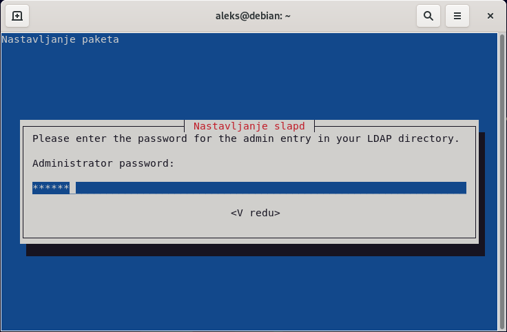

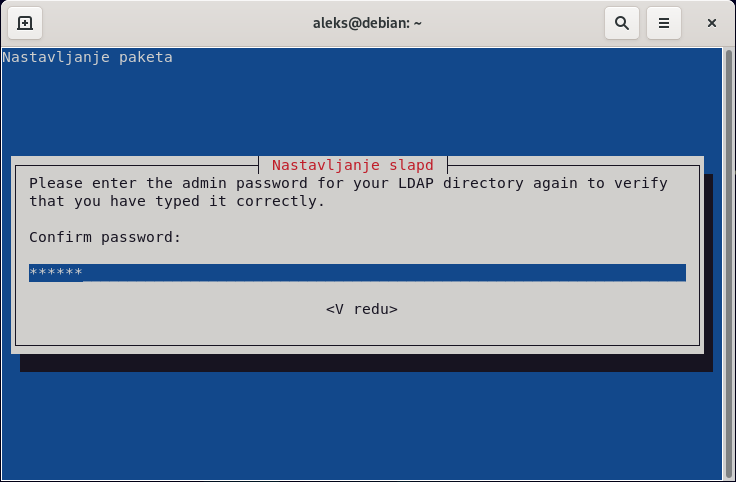

Delovanje strežnika lahko preizkusimo z ukazom `ldapsearch`, ki omogoča izvajanje poizvedb po bazi LDAP. Na primer, uporabimo poenostavljeno avtentikacijo z zastavico `-x`, za izhodiščno bazo izberemo karkoli z zastavico `-b`, določimo način poizvedovanja na nivo baze z zastavico `-s` in želimo izpisati podatkovno polje `namingContexts` za vse razrede objektov.

    ldapsearch -x -b '' -s base '(objectclass=*)' namingContexts

    # extended LDIF
    #
    # LDAPv3
    # base <> with scope baseObject
    # filter: (objectclass=*)
    # requesting: namingContexts 
    #

    #
    dn:
    namingContexts: dc=nodomain

    # search result
    search: 2
    result: 0 Success

    # numResponses: 2
    # numEntries: 1

Ugotovimo, da nimamo trenutno ustvarjene nobene baze LDAP, zato jo ustvarimo, tako da ponovno poženemo celoten postopek nastavitve LDAP strežnika.

    dpkg-reconfigure slapd

V prvem koraku poženemo postopek za vzpostavitev baze LDAP, tako da izberemo gumb `Ne`.

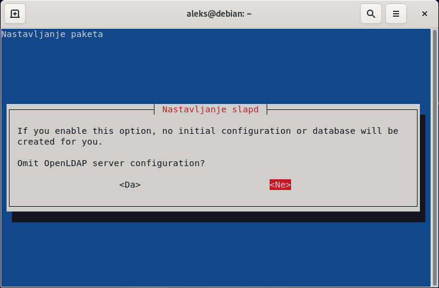

V drugem koraku si izberemo domeno naše baze LDAP, na primer `kpov.fri.uni-lj.si` in pritisnemo gumb `V redu`.

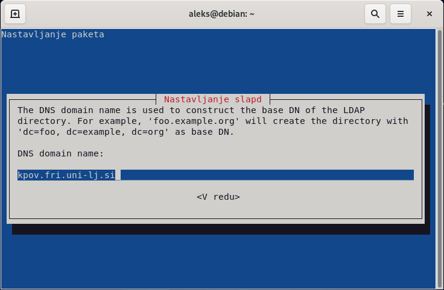

V tretjem koraku si izberemo ime naše organizacije, na primer `KPOV` in pritisnemo na gumb `V redu`.

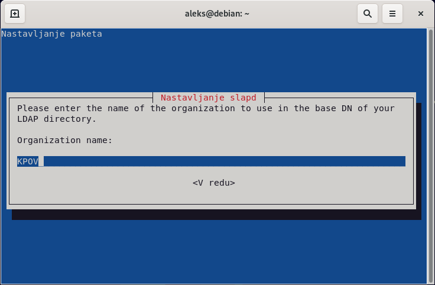

V naslednjem koraku si izberemo novo skrbniško geslo in pritisnemo gumb `V redu`. Nato pa geslo ponovno vnesemo in spet pritisnemo gumb `V redu`.

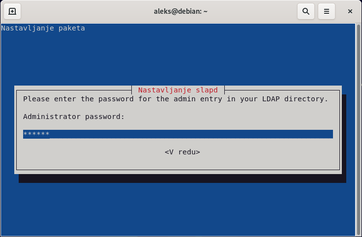

Nato potrdimo, da se ob odstranitvi LDAP strežnika `slapd` pobriše tudi baza LDAP s pritiskom na gumb `Da`.

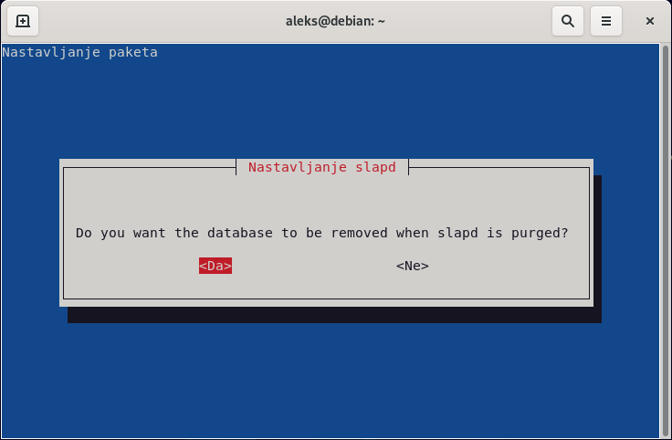

V zadnjem koraku še potrdimo premik oz. izbris nastavitev predhodnih baz LDAP s pritiskom na gumb `Da`, da lahko uspešno nastavimo novo bazo LDAP.

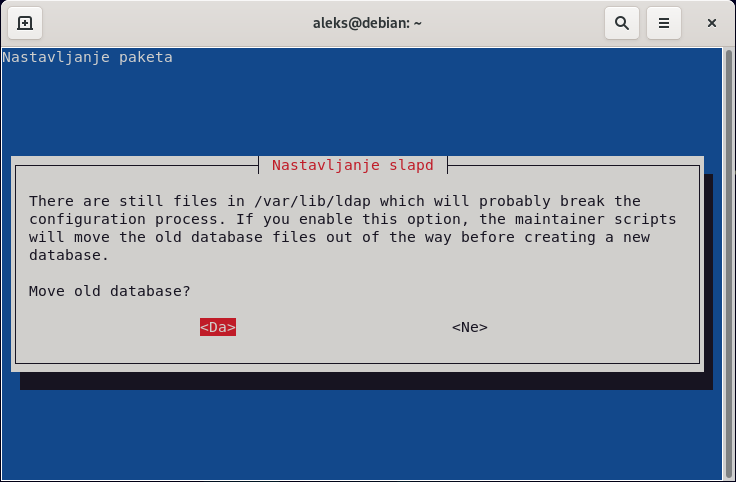

Sedaj ponovno poženemo ukaz `ldapsearch` in preverimo ali sedaj obstaja baza LDAP z našo domeno.

    ldapsearch -x -b '' -s base '(objectclass=*)' namingContexts

    # extended LDIF
    #
    # LDAPv3
    # base <> with scope baseObject
    # filter: (objectclass=*)
    # requesting: namingContexts 
    #

    #
    dn:
    namingContexts: dc=kpov,dc=fri,dc=uni-lj,dc=si

    # search result
    search: 2
    result: 0 Success

    # numResponses: 2
    # numEntries: 1

### 2. Naloga

Namestimo poljubni spletni vmesnik za upravljanje z LDAP strežnikom. Na primer [`LDAP Account Manager`](https://www.ldap-account-manager.org/lamcms/), ki ga lahko namestimo preko upravljalca paketkov našega operacijskega sistema. Prav tako namestimo spletni strežnik `apache2`, če ga še nimamo.

    apt install apache2 ldap-account-manager

Po uspešni namestitvi nadaljujemo namestitev preko brskalnika na spletnem naslovu `http://localhost/lam`. Kliknemo na povezavo `LAM konfiguracija` v zgornjem desnem kotu.

Najprej kliknemo na povezavo za `Urejanje strežniških profilov`.

Da lahko spreminjamo nastavitve moramo vpisati `Geslo` strežniškega profila `lam`, ki je privzeto tudi `lam`.

V nastavitvah strežniškega profila `lam` pod zavihkom `Splošne nastavitve` pod poglavjem `Nastavitve orodij` v polje `Drevesna pripona` vnesemo domeno našega imenika `dc=kpov,dc=fri,dc=uni-lj,dc=si`. Prav tako pod zavihkom `Splošne nastavitve` pod poglavjem `Varnostne nastavitve` v polje `Seznam veljavnih uporabnikov` vnesemo ime našega administratorja `cn=admin,dc=kpov,dc=fri,dc=uni-lj,dc=si`, ki smo ga ustvarili med namestitvijo LDAP strežnika `slapd`.

Sedaj pa v nastavitvah strežniškega profila `lam` pod zavihkom `Tipi računov` pod poglavjem `Uporabniki` v polje `LDAP pripona` spremenimo domeno za uporabnike na `ou=People,dc=kpov,dc=fri,dc=uni-lj,dc=si`. Prav tako pod poglavjem `Skupine` v polje `LDAP pripona` spremenimo domeno za skupine uporabnikov na `ou=group,dc=kpov,dc=fri,dc=uni-lj,dc=si`. Sedaj še pritisnemo spodaj desno na gumb `Shrani`, da shranimo spremembe.

Vpišemo se sedaj v spletni vmesnik `LDAP Account Manager` z uporabniškim imenom `admin` in geslom, ki smo ga določili pri namestitvi `slapd`.

Ko se prvič vpišemo v spletni vmesnik, dobimo opozorilo, da nam manjkajo pripone za uporabnike in uporabniške skupine. Omenjene pripone lahko ustvarimo s pritiskom na gumb `Ustvari`.

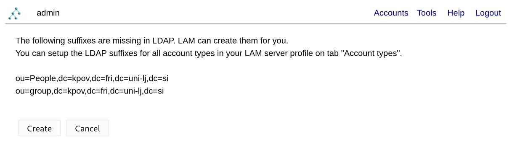

### 3. Naloga

Sedaj ustvarimo novo skupino za uporabnike, tako da izberemo povezavo `Računi` zgoraj desno in kliknemo na povezavo `Skupine`.

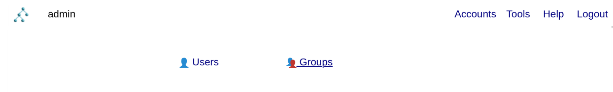

Skupino ustvarimo tako da pritisnemo na gumb `Nova skupina`.

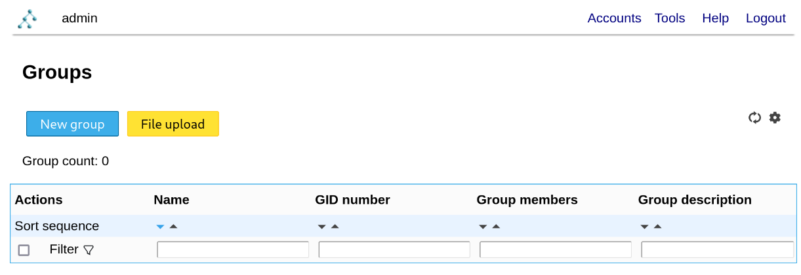

V polju `Ime skupine` poimenujemo novo skupino, na primer `kpovuporabniki` in jo nato ustvarimo s pritiskom na gumb `Shrani` zgoraj levo.

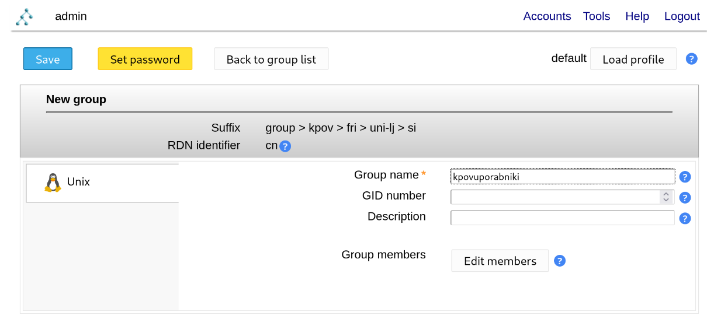

Sedaj ustvarimo še dva nova uporabnika, tako da izberemo povezavo `Računi` zgoraj desno in kliknemo na povezavo `Uporabniki`.

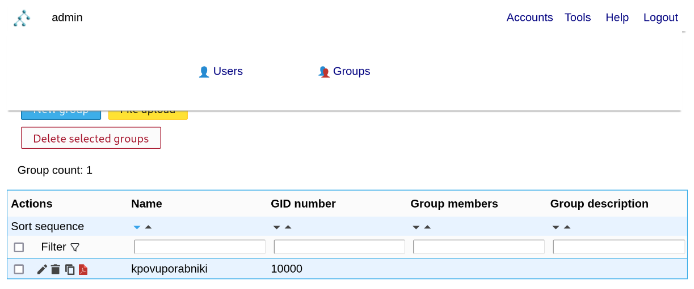

Uporabnika ustvarimo tako, da pritisnemo na gumb `Nov uporabnik`.

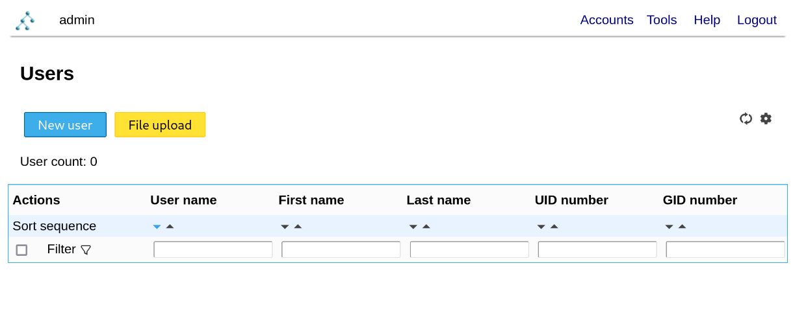

Pod zavihkom `Osebno` vnesem v polje `Ime` ime uporabnika in v polje `Priimek` priimek uporabnika, na primer `Janze Novak`.

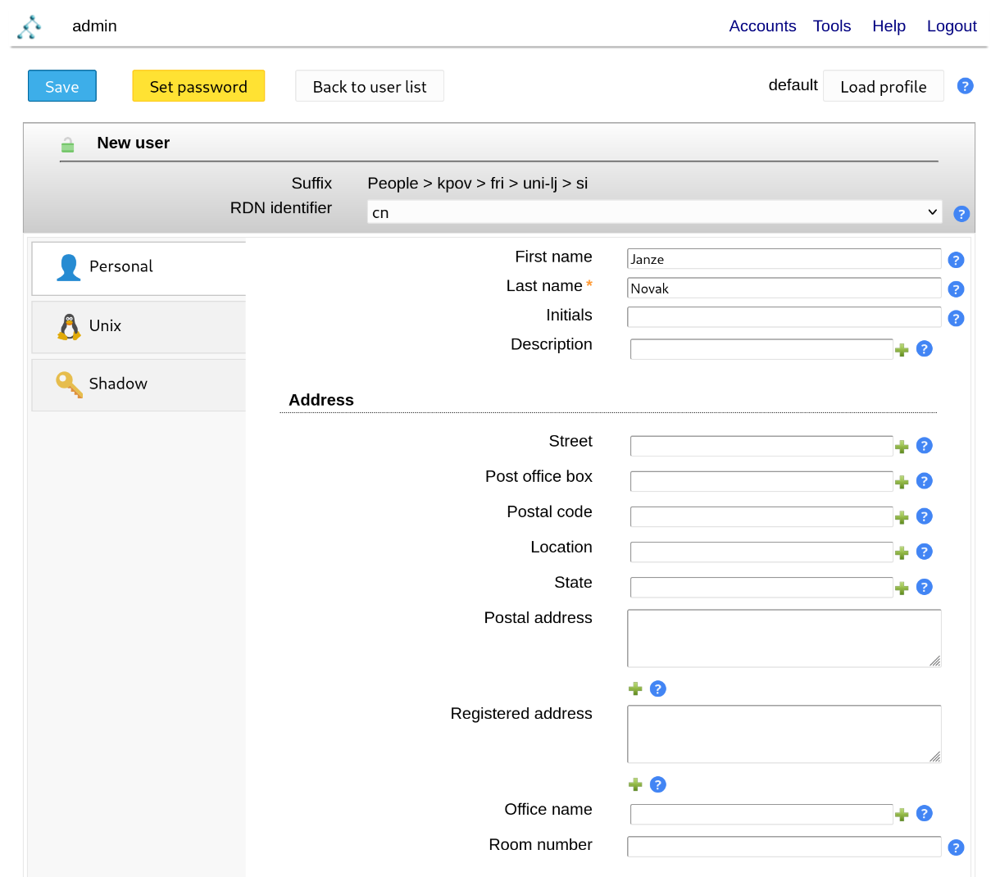

Klikniti moramo še na zavihek `Unix`, da se nam avtomatsko izpolnijo potrebna polja, ki nam omogočajo uporabo LDAP uporabnika, kot uporabnika operacijskega sistema Linux.

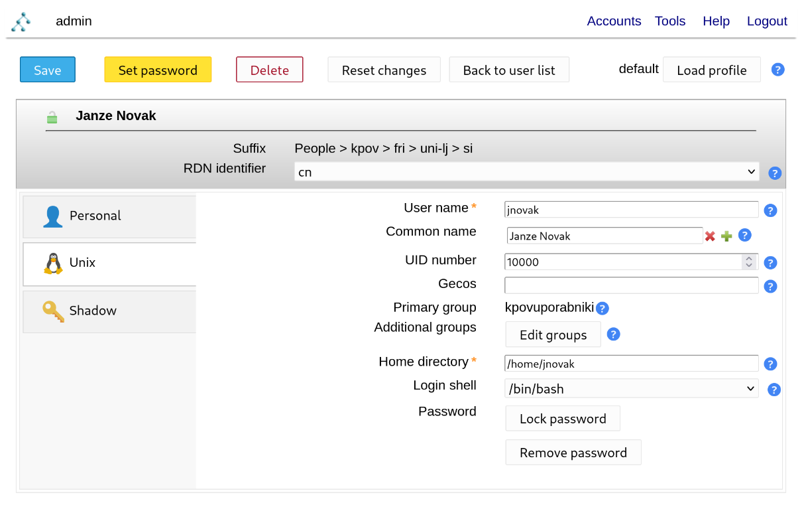

S klikom na gumb `Nastavi geslo` zgoraj levo se nam odpre okno kjer v polji `Geslo` in `Ponovljeno geslo` vnesemo geslo novega uporabnika in ga shranimo s klikom na gumb `V redu`.

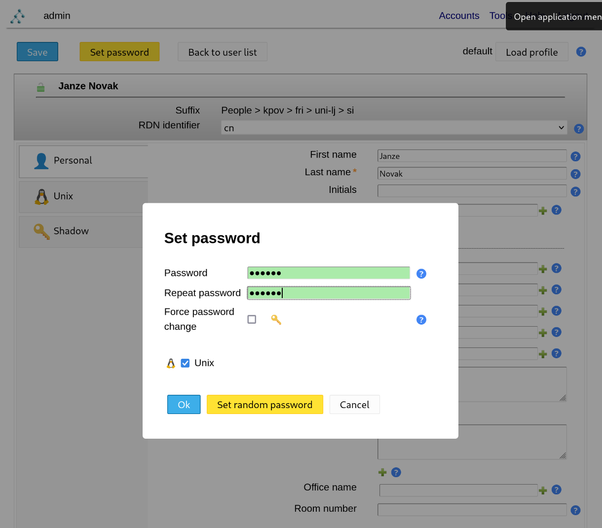

Sedaj ustvarimo novega uporabnika s kliko na gumb `Shrani` zgoraj levo. Po enakem postopku ustvarimo še enega uporabnika.

### 4. Naloga

Lokalno lahko preko ukazne vrstice poizvedujemo po bazi LDAP z orodjem `ldapsearch`.

    ldapsearch -Y EXTERNAL -H ldapi:/// -b dc=kpov,dc=fri,dc=uni-lj,dc=si "givenName=Janze"

    SASL/EXTERNAL authentication started
	SASL username: gidNumber=0+uidNumber=0,cn=peercred,cn=external,cn=auth
	SASL SSF: 0
	# extended LDIF
	#
	# LDAPv3
	# base <dc=kpov,dc=fri,dc=uni-lj,dc=si> with scope subtree
	# filter: givenName=Janze
	# requesting: ALL
	#
	
	# Janze Novak, People, kpov.fri.uni-lj.si
	dn: cn=Janze Novak,ou=People,dc=kpov,dc=fri,dc=uni-lj,dc=si
	objectClass: posixAccount
	objectClass: inetOrgPerson
	objectClass: organizationalPerson
	objectClass: person
	loginShell: /bin/bash
	homeDirectory: /home/jnovak
	uid: jnovak
	cn: Janze Novak
	uidNumber: 10000
	gidNumber: 10000
	sn: Novak
	givenName: Janze

	# Janze Godec, People, kpov.fri.uni-lj.si
	dn: cn=Janze Godec,ou=People,dc=kpov,dc=fri,dc=uni-lj,dc=si
	objectClass: posixAccount
	objectClass: inetOrgPerson
	objectClass: organizationalPerson
	objectClass: person
	loginShell: /bin/bash
	homeDirectory: /home/jgodec
	uid: jgodec
	cn: Janze Godec
	uidNumber: 10001
	gidNumber: 10000
	sn: Godec
	givenName: Janze

	# search result
	search: 2
	result: 0 Success

	# numResponses: 3
	# numEntries: 2

    ldapsearch -Y EXTERNAL -H ldapi:/// -b dc=kpov,dc=fri,dc=uni-lj,dc=si "givenName=Ja*"

    SASL/EXTERNAL authentication started
	SASL username: gidNumber=0+uidNumber=0,cn=peercred,cn=external,cn=auth
	SASL SSF: 0
	# extended LDIF
	#
	# LDAPv3
	# base <dc=kpov,dc=fri,dc=uni-lj,dc=si> with scope subtree
	# filter: givenName=Ja*
	# requesting: ALL
	#
	
	# Janze Novak, People, kpov.fri.uni-lj.si
	dn: cn=Janze Novak,ou=People,dc=kpov,dc=fri,dc=uni-lj,dc=si
	objectClass: posixAccount
	objectClass: inetOrgPerson
	objectClass: organizationalPerson
	objectClass: person
	loginShell: /bin/bash
	homeDirectory: /home/jnovak
	uid: jnovak
	cn: Janze Novak
	uidNumber: 10000
	gidNumber: 10000
	sn: Novak
	givenName: Janze

	# Janze Godec, People, kpov.fri.uni-lj.si
	dn: cn=Janze Godec,ou=People,dc=kpov,dc=fri,dc=uni-lj,dc=si
	objectClass: posixAccount
	objectClass: inetOrgPerson
	objectClass: organizationalPerson
	objectClass: person
	loginShell: /bin/bash
	homeDirectory: /home/jgodec
	uid: jgodec
	cn: Janze Godec
	uidNumber: 10001
	gidNumber: 10000
	sn: Godec
	givenName: Janze

	# search result
	search: 2
	result: 0 Success

	# numResponses: 3
	# numEntries: 2

    ldapsearch -Y EXTERNAL -H ldapi:/// -b dc=kpov,dc=fri,dc=uni-lj,dc=si "(&(givenName=Ja*)(uid=jnovak))"

    SASL/EXTERNAL authentication started
	SASL username: gidNumber=0+uidNumber=0,cn=peercred,cn=external,cn=auth
	SASL SSF: 0
	# extended LDIF
	#
	# LDAPv3
	# base <dc=kpov,dc=fri,dc=uni-lj,dc=si> with scope subtree
	# filter: (&(givenName=Ja*)(uid=jnovak))
	# requesting: ALL
	#

	# Janze Novak, People, kpov.fri.uni-lj.si
	dn: cn=Janze Novak,ou=People,dc=kpov,dc=fri,dc=uni-lj,dc=si
	objectClass: posixAccount
	objectClass: inetOrgPerson
	objectClass: organizationalPerson
	objectClass: person
	loginShell: /bin/bash
	homeDirectory: /home/jnovak
	uid: jnovak
	cn: Janze Novak
	uidNumber: 10000
	gidNumber: 10000
	sn: Novak
	givenName: Janze

	# search result
	search: 2
	result: 0 Success

	# numResponses: 2
	# numEntries: 1

Prav tako pa lahko poizvedujemo po bazi LDAP tudi z drugega navideznega računalnika z orodjem `ldapsearch`, ki ga namestimo s paketom `ldap-utils` preko upravljalca paketov našega operacijskega sistema.

	apt install ldap-utils

    ldapsearch -H ldap://SERVER_IP:389/ -D cn=admin,dc=kpov,dc=fri,dc=uni-lj,dc=si -b dc=kpov,dc=fri,dc=uni-lj,dc=si "(|(sn=G*)(uid=jnovak))" -W

    # extended LDIF
	#
	# LDAPv3
	# base <dc=kpov,dc=fri,dc=uni-lj,dc=si> with scope subtree
	# filter: (|(sn=G*)(uid=jnovak))
	# requesting: ALL
	#
	
	# Janze Novak, People, kpov.fri.uni-lj.si
	dn: cn=Janze Novak,ou=People,dc=kpov,dc=fri,dc=uni-lj,dc=si
	objectClass: posixAccount
	objectClass: inetOrgPerson
	objectClass: organizationalPerson
	objectClass: person
	loginShell: /bin/bash
	homeDirectory: /home/jnovak
	uid: jnovak
	cn: Janze Novak
	uidNumber: 10000
	gidNumber: 10000
	userPassword:: e1NTSEF9VFY2V0FldE9QeGpkc05KL2Y3ZlBlSXlpQkVabFVHcHk=
	sn: Novak
	givenName: Janze
	
	# Janze Godec, People, kpov.fri.uni-lj.si
	dn: cn=Janze Godec,ou=People,dc=kpov,dc=fri,dc=uni-lj,dc=si
	objectClass: posixAccount
	objectClass: inetOrgPerson
	objectClass: organizationalPerson
	objectClass: person
	loginShell: /bin/bash
	homeDirectory: /home/jgodec
	userPassword:: e1NTSEF9cnFaQ3ZwRTg1a05TTDZsSVlpTjQ3Y0VISU50V1Z6Ukk=
	uid: jgodec
	cn: Janze Godec
	uidNumber: 10001
	gidNumber: 10000
	sn: Godec
	givenName: Janze
	
	# search result
	search: 2
	result: 0 Success
	
	# numResponses: 3
	# numEntries: 2

### 5. Naloga

Na drugem virtualnem računalniku namestimo paketka `libpam-ldapd`, ki skrbi za avtentikacijo uporabnikov (Pluggable Authentication Module - PAM) in `libnss-ldapd`, ki skrbi za preslikovanje med LDAP in uporabniki operacijskega sistema (Name Service Switch - NSS).

    apt install libpam-ldapd libnss-ldapd

Med namestitvijo moramo podati IP naslov našega prvega virtualnega računalnika, na katerem teče LDAP strežnik in pritisnemo na gumb `V redu`.

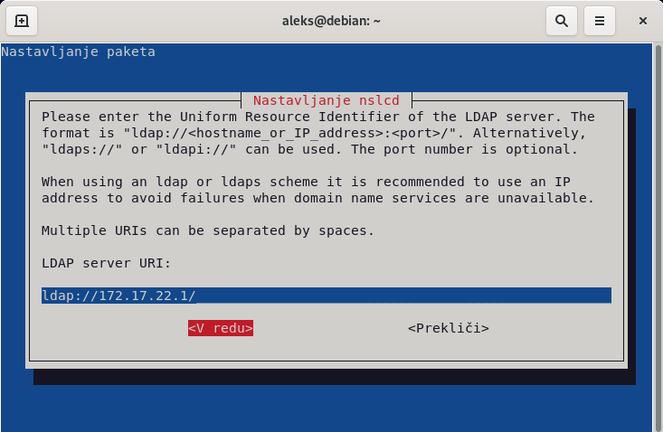

Nato vnesemo še domene naše baze LDAP, ki se nahaja na našem LDAP strežniku in pritisnemo na gumb `V redu`.

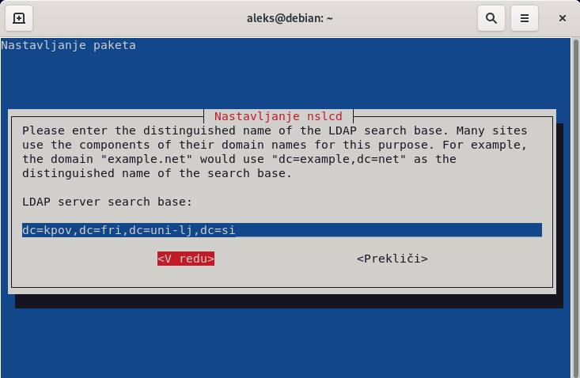

Izberemo bazo uporabnikov `passwd`, bazo skupin `group` in bazo gesel `shadow`, ki jih bomo preslikovali za LDAP uporabnike.

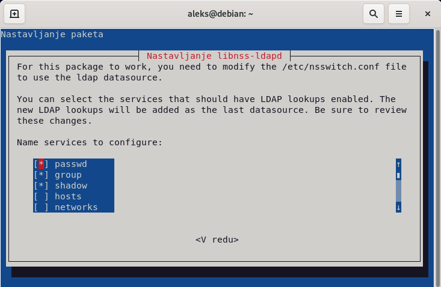

Preverimo ali so LDAP uporabniki že dosegljivi kot lokalni uporabniki operacijskega sistema z ukazom `getent`.

    getent passwd aleks

    aleks:x:1000:1000:Aleks,,,:/home/aleks:/bin/bash

    getent passwd jnovak

	jnovak:*:10000:10000:Janze Novak:/home/jnovak:/bin/bash
    
    getent passwd jgodec

	jgodec:*:10001:10000:Janze Godec:/home/jgodec:/bin/bash

Če slučajno ne vidimo LDAP uporabniki kot lokalne uporabnike operacijskega sistema, potem ponovno poženemo nastavitev paketa `nslcd` (NSLCD - LDAP Connection Daemon), ki je lokalna storitev za razrešavanje LDAP imen oziroma uporabnikov. Kjer ponovno vnesemo IP naslov našega prvega virtualnega računalnika, na katerem teče LDAP strežnik in pritisnemo na gumb `V redu`.

    dpkg-reconfigure nslcd

Nato vnesemo še domene naše baze LDAP, ki se nahaja na našem LDAP strežniku in pritisnemo na gumb `V redu`.

Sedaj pa izberemo, da ne bomo uporabljali nobene LDAP avtentikacije `none` in pritisnemo na gumb `V redu`.

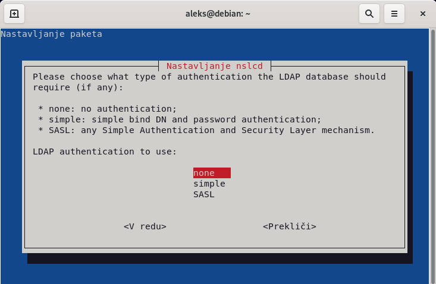

Prav tako izberemo, da ne bomo šifrirali poveza do našega LDAP strežnika, tako da pritisnemo na gumb `Ne`.

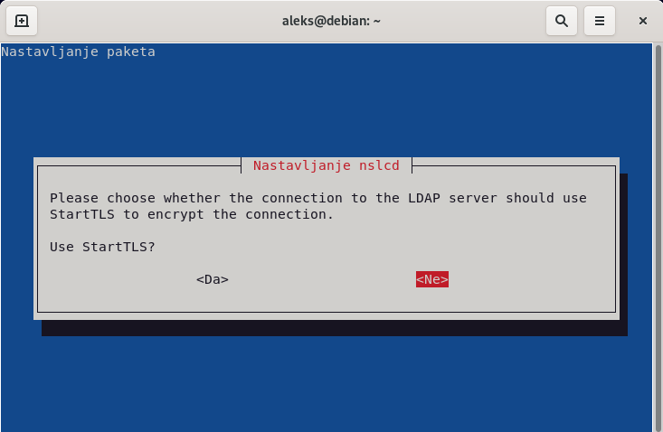

Ponovno poženemo še nastavitev paketa, kjer moramo izbrati bazo uporabnikov `passwd`, bazo skupin `group` in bazo gesel `shadow`.

    dpkg-reconfigure libnss-ldapd

Sedaj ponovno zaženemo `nslcd` in `nscd` (NSCD - Name Service Cache Daemon), ki izvaja predpomnenje za `nslcd` ter ponovno poženemo ukaz `getent`, da preverimo ali do naši LDAP uporabniki že dosegljivi kot lokalni uporabniki operacijskega sistema.

    service nslcd restart
    service nscd restart

    getent passwd jnovak

	jnovak:*:10000:10000:Janze Novak:/home/jnovak:/bin/bash
    
    getent passwd jgodec

	jgodec:*:10001:10000:Janze Godec:/home/jgodec:/bin/bash

Sedaj pa omogočimo še avtentikacijo, tako da poženemo ukaz `pam-auth-update` in izberemo, da omogočimo `Unix avtentikacijo`, `LDAP avtentikacijo`, `Registiramo uporabniško sejo v systemd kontrolno skupino...`, `Ustvarimo domači imenik ob vpisu` in `GNOME storitev za upravljanje s ključi za vpis` ter pritisnemo na gumb `V redu`.

    pam-auth-update

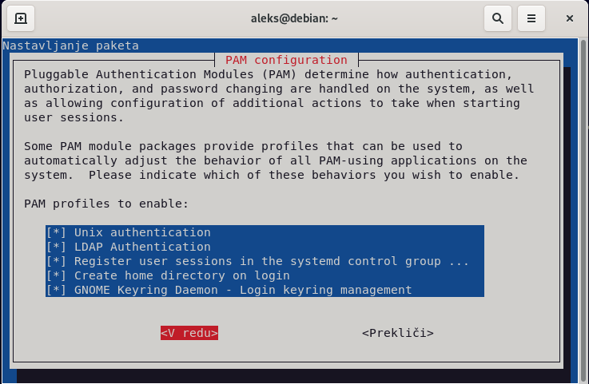

Sedaj se vpišemo z LDAP uporabnikoma v naš lokalni operacijski sistem, da preverimo delovanje, na primer z ukazoma `ls` in `su`.

    ls /home

    aleks

    su - jnovak

    Creating directory '/home/jnovak'.

    ls /home

    aleks jnovak

    su - jgodec

    Creating directory '/home/jgodec'.

    ls /home

    aleks jnovak jgodec
