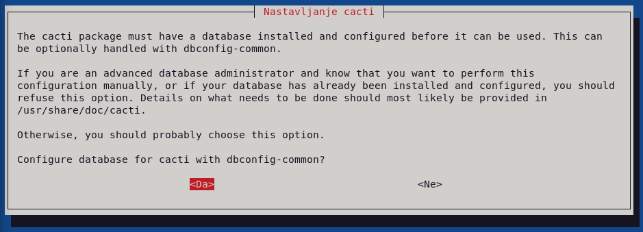
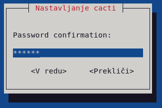
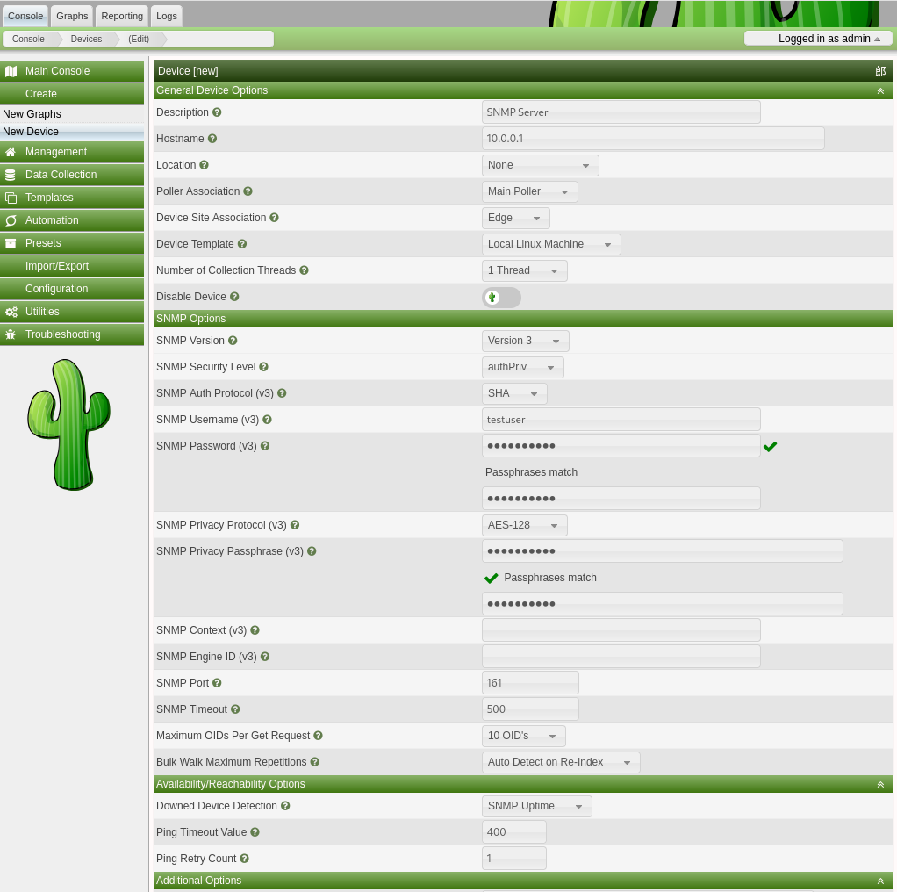
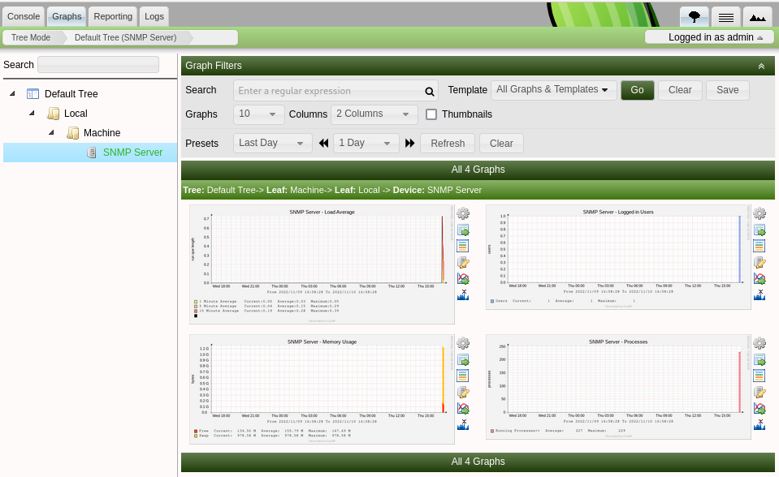

# 6. Vaja: Upravljanje omrežja

## Navodila

0. Uporabite omrežje in navidezne računalnike iz prejšnjih vaj. 
1. Postavit Simple Network Management Protocol (SNMP) strežnik.
2. Pridobite podatke s SNMP strežnika preko SNMPv1 protokola.
3. Prejete podatke naredimo berljive.
4. Pridobite podatke s SNMP strežnika preko SNMPv3 protokola.
5. Namestite spletno aplikacijo za zbiranje SNMP podatkov.

## Dodatne informacije

[Simple Network Management Protocol (SNMP)](https://en.wikipedia.org/wiki/Simple_Network_Management_Protocol) je standardni protokol z izmenjevanje podatkov preko omrežja o stanju računalnikov in omrežja.

SNMP uporablja za prenos podatkov format [Type Length Value (TLV)](https://en.wikipedia.org/wiki/Type-length-value).

Za upravljanje s SNMP podatki uporabljamo podatkovno zbirko [Management Information Base (MIB)](https://en.wikipedia.org/wiki/Management_information_base).

Pogosto uporabljane spletne aplikacije za zbiranje SNMP podatkov:
- [ICINGA](https://icinga.com/)
- [Nagios](https://www.nagios.org/)
- [Zabbix](https://www.zabbix.com/)
- [Cacti](https://www.cacti.net)

## Podrobna navodila

### 1. Naloga

Namestimo SNMP strežnik na prvi navidezni računalnik, na primer `snmpd`, ter SNMP odjemalca za preizkus delovanje, na primer `snmp`.

    apt install snmpd snmp

### 2. Naloga

Do SNMP podatkov dostopamo z ukazom `snmpwalk`, kadar želimo izpis vseh dostopnih podatkov in z ukazom `snmpget`, kadar želimo dostopati do posameznega podatka. Na primer, uporabimo `snmpwalk` in navedemo da uporabljamo verzijo protokola `SNMPv1`, dostopamo do skupnosti `public` in dostopamo do SNMP strežnika na IP naslovu `localhost`.

    snmpwalk -v 1 -c public localhost

Skupnosti nam pri verziji protokola SNMPv1 omogočajo določanje podskupin podatkov do katerih lahko dostopamo preko njih in jih urejamo v nastavitveni datoteki `/etc/snmp/snmpd.conf`. Ustvarimo novo skupnost, ki nam omogoča dostop do vseh podatkov, ki jih hrani SNMP strežnik.

    nano /etc/snmp/snmpd.conf

    rocommunity community

Da se nastavitve upoštevajo, ponovno zaženemo `snmpd` SNMP strežnik in preskusimo delovanje z ukazom `snmpwalk`.

    systemctl restart snmpd.service

    snmpwalk -v 1 -c community localhost

V nastavitveni datoteki `/etc/snmp/snmpd.conf` tudi omejimo dostop do SNMP strežnika na podlagi IP naslovov odjemalcev. V našem primeru bomo omogočilo dostop z vseh IP naslovov. 

    nano /etc/snmp/snmpd.conf

    agentaddress 0.0.0.0,[::1]

Da se nastavitve upoštevajo, ponovno zaženemo `snmpd` SNMP strežnik in preskusimo delovanje z ukazom `snmpwalk` z drugega navideznega računalnika.

    systemctl restart snmpd.service

    snmpwalk -v 1 -c community 10.0.0.1

### 3. Naloga

Podatki se izpišejo v formatu TLV in vidimo, da ima vsak podatek svoj hierarhično urejen identifikator Object Identifier (OID). Izpis podatkov lahko naredimo bolj berljiv, če uporabimo podatkovno zbirko MIB, ki preslika OID-je v opisne identifikatorje. Za namestitev zbirke MIB potrebujemo omogočiti dodatne ne odprtokodne repozitorije `non-free` in `contrib` v upravljalcu paketov na obeh navideznih računalnikih, da lahko potem namestimo zbirke na obeh.

    nano /etc/apt/sources.list

    deb http://deb.debian.org/debian/ bullseye main non-free contrib
    deb-src http://deb.debian.org/debian/ bullseye main non-free contrib

    apt update
    apt install snmp-mibs-downloader

Preskusimo delovanje zbirke MIB z ukazom `snmpwalk`.

    snmpwalk -m all -v 1 -c community localhost

### 4. Naloga

Glavna pomanjkljivost protokola verzije `SNMPv1` je, da ne podpira overjanja (angl. authentication) uporabnikov in ne šifrira (angl. encryption) poslanih podatkov. Verzija `SNMPv3` odpravi ti dve pomanjkljivosti in vsebuje tudi kopico drugih izboljšav. Za dostop do podatkov sedaj potrebujemo ustvariti uporabnika in zato uporabite že v naprej pripravljen program. Uporabniku, na primer omogočimo samo branje podatkov, način overjanja in geslo za overjanje ter način šifriranja in ključ za šifriranje.

    apt install libsnmp-dev

    systemctl stop snmpd.service

    mkdir /snmp

    net-snmp-create-v3-user -ro -a SHA -A kpovkaboom -x AES -X kpovkaboom testuser

    cp /snmp/snmpd.conf /usr/share/snmp/snmpd.conf

Preverimo v nastavitvenih datotekah `/var/lib/snmp/snmpd.conf` in `/usr/share/snmp/snmpd.conf`, če se je uporabnik pravilno ustvaril in nato ponovno zaženemo SNMP strežnik ter preskusimo delovanje z ukazom `snmpwalk`.

    nano /var/lib/snmp/snmpd.conf

    createUser testuser SHA "kpovkaboom" AES "kpovkaboom"

    nano /usr/share/snmp/snmpd.conf

    rouser testuser

    systemctl restart snmpd.service

    nano /var/lib/snmp/snmpd.conf

    usmUser 1 3 0x80001f888082f37f51ace86c6300000000 "testuser" "testuser" NULL .1.3.6.1.6.3.10.1.1.3 0xeadfd1e83a80f141853375b1c4d7660b2be4d297 .1.3.6.1.6.3.10.1.2.4 0xeadfd1e83a80f141853375b1c4d7660b 0x

    snmpwalk -v 3 -m all -a SHA -A kpovkaboom -x AES -X kpovkaboom -l authPriv -u testuser 10.0.0.1

### 5. Naloga

Namestimo spletno aplikacijo za pridobivanje podatkov preko SNMP protokola, na primer `cacti`.

    apt install cacti

Med namestitvijo izberemo da bo spletna aplikacija `cacti` uporabljali spletni strežnik `apache2` in pritisnemo na gumb `OK`.

Za potrebe hranjenja podatkov uporabimo podatkovno bazo za katero izberemo, da se avtomatsko nastavi na privzete nastavitve s pritiskom na gumb `Yes`.

Nato še vnesemo geslo za administratorski račun ter pritisnemo na gumb `OK` in ga potem s ponovnim vnosom in pritiskom na gumb `OK` še potrdimo.

Do spletne aplikacije dostopamo preko brskalnika.

    http://10.0.0.1/cacti

V spletno aplikacijo se vpišemo z uporabniškim imenom `admin` in geslom, ki smo ga izbrali med namestitvijo.

Za prejemanje SNMP podatkov moramo dodati naš strežnik, tako da pod menijem na levi izberemo `Create\New Device` in izpolnimo obrazec za dodajanje nove naprave. Na primer, za opis `Description` izberemo `SNMP Server`, za IP naslov `Hostname` izberemo IP naslov našega SNMP strežnika `10.0.0.1`, za verzijo protokola SNMP `SNMP Version` izberemo verzijo `Version 3`, za nivo varnosti `SNMP Security Level`izberemo `authPriv`, za uporabnika `SNMP Username (v3)` izberemo uporabnika, ki smo go prej ustvarili `testuser`, Za protokol za overjanje `SNMP Auth Protocol` izberemo `SHA` ter vnesemo geslo za oviranje pod `SNMP Password (v3)`, za protokol za šifriranje `SNMP Privacy Protocol (v3)` izberemo `AES` ter vnesem ključ za šifriranje pod `SNMP Privacy Passphrase` in vse ostale nastavitve pustimo na privzetih vrednostih. Obrazec potrdimo s pritiskom na gumb ustvari `Create` spodaj desno.

Do podatkov sedaj dostopamo preko zavihkov zgoraj levo, na primer do grafov `Graphs`.

Če imamo težave z zagonom strežnika `apache2`, preverimo ali je port `80` že zaseden z ukazom `netstat` in ustavimo proces, ki ga uporablja.

    apt install net-tools

    netstat -plnt

    Active Internet connections (only servers)
    Proto Recv-Q Send-Q Local Address           Foreign Address         State       PID/Program name    
    tcp        0      0 0.0.0.0:57161           0.0.0.0:*               LISTEN      635/rpc.mountd      
    tcp        0      0 127.0.0.1:3306          0.0.0.0:*               LISTEN      767/mariadbd        
    tcp        0      0 0.0.0.0:111             0.0.0.0:*               LISTEN      1/init              
    tcp        0      0 0.0.0.0:41681           0.0.0.0:*               LISTEN      635/rpc.mountd      
    tcp        0      0 127.0.0.1:631           0.0.0.0:*               LISTEN      618/cupsd           
    tcp        0      0 0.0.0.0:35931           0.0.0.0:*               LISTEN      635/rpc.mountd      
    tcp        0      0 0.0.0.0:33949           0.0.0.0:*               LISTEN      -                   
    tcp        0      0 0.0.0.0:2049            0.0.0.0:*               LISTEN      -                   
    tcp6       0      0 :::54603                :::*                    LISTEN      635/rpc.mountd      
    tcp6       0      0 :::47405                :::*                    LISTEN      635/rpc.mountd      
    tcp6       0      0 :::111                  :::*                    LISTEN      1/init              
    tcp6       0      0 :::80                   :::*                    LISTEN      957/apache2         
    tcp6       0      0 :::60819                :::*                    LISTEN      635/rpc.mountd      
    tcp6       0      0 :::46549                :::*                    LISTEN      -                   
    tcp6       0      0 ::1:631                 :::*                    LISTEN      618/cupsd           
    tcp6       0      0 :::2049                 :::*                    LISTEN      - 

