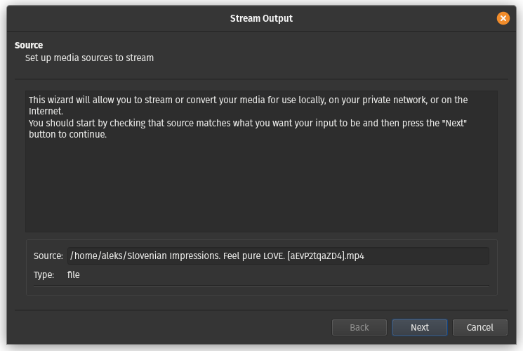
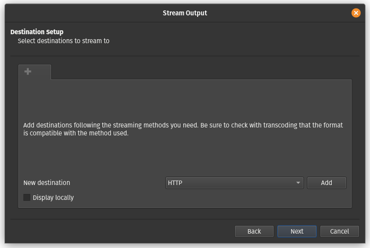
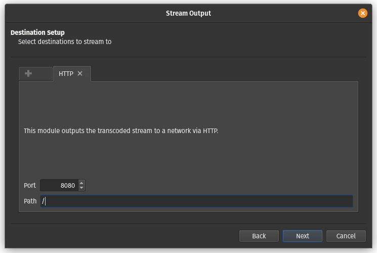
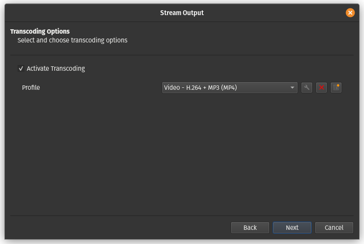
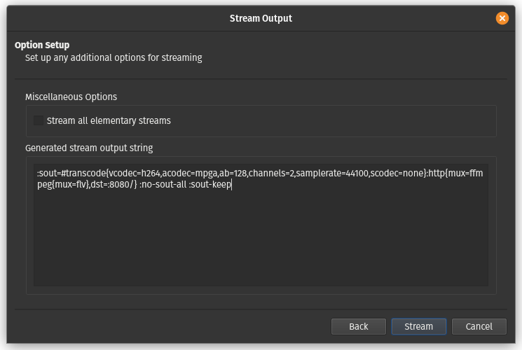
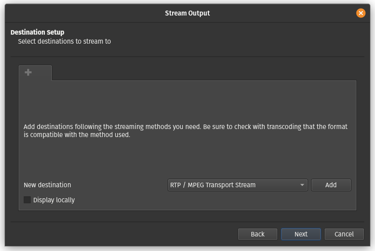
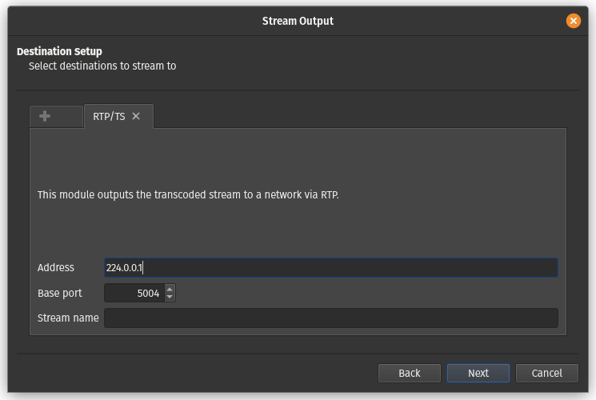

# 8. Vaja: Pretakanje video vsebine preko omrežja

## Navodila

0. Uporabite omrežje in navidezne računalnike iz prejšnjih vaj. 
1. Varno prenesi poljubni video posnetek s spletne platforme YouTube.
2. Uporabi program VLC za pretakanje video vsebine preko protokola HTTP in zajemite izmenjane pakete z Wiresharkom.
3. Uporabi program VLC za pretakanje video vsebine preko protokola RTP in uporabite razpošiljanje ter zajemite izmenjane pakete z Wiresharkom.

## Dodatne informacije

[YouTube](https://en.wikipedia.org/wiki/YouTube) je spletna platforma za deljenje video vsebin in služi kot tudi socialno omrežje.

[youtube-dl](https://github.com/ytdl-org/youtube-dl/) izvirni program za prenašanje video vsebine s spletne platforme YouTube.

[yt-dlp](https://github.com/yt-dlp/yt-dlp) je program, ki izboljša in razširi `youtube-dl`.

[VLC](https://www.videolan.org/vlc/) program za predvajanje audio in video datotek ter pretočnih protokolov.

[Hypertext Transfer Protocol - HTTP](https://en.wikipedia.org/wiki/Hypertext_Transfer_Protocol) protokol na aplikacijskih plasti za deljenje podatkov na spletu. Prvotno je bil namenjen objavljanju in prejemanju strani v [HyperText Markup Language - HTML](https://en.wikipedia.org/wiki/HTML) formatu.

[Uniform Resource Locator - URL](https://en.wikipedia.org/wiki/URL) predstavlja referenco spletni vir, ki določi njegovo lokacijo in način za njegovo pridobitev.

[Real-time Transport Protocol](https://en.wikipedia.org/wiki/Real-time_Transport_Protocol) je omrežni protokol za prenašanje audio in video vsebine preko IP omrežja.

[Real Time Streaming Protocol](https://en.wikipedia.org/wiki/Real_Time_Streaming_Protocol) je omrežni protokol na aplikacijski plasti, ki upravlja s prenosom multi-medijskih vsebin preko primernega protokola na transportni plasti.

[Real Time Control Protocol](https://en.wikipedia.org/wiki/RTP_Control_Protocol) je omrežni protokol, ki zagotavlja statistiko in nadzor RTP povezave.

[Razpošiljanje (angl. Multicast)](https://en.wikipedia.org/wiki/Multicast) je način komunikacije, ki omogoča pošiljanje podatkov skupni omrežnih računalnikov hkrati.

IP naslovi določeni za razpošiljanje:

| Omrežni blok   | Interval                      | Št. naslovov |
|----------------|-------------------------------|--------------|
| 224.0.0.0/4    | 224.0.0.0 - 239.255.255.255   | 268435456    |

## Podrobna navodila

### 1. Naloga

Namestimo program `yt-dlp` za prenos video vsebine s spletne platforme [YouTube](https://www.youtube.com/) preko ukaza [`curl`](https://linux.die.net/man/1/curl). Prav tako lahko namestimo skupek orodij [`ffmpeg`](https://www.ffmpeg.org/) za pretvarjanje med različnimi formati medijev.

    apt install curl ffmpeg

    curl -L https://github.com/yt-dlp/yt-dlp/releases/latest/download/yt-dlp -o /usr/local/bin/yt-dlp
    
    chmod a+rx /usr/local/bin/yt-dlp 

Sedaj še ponovno zaženemo okno terminala. Ko želimo prenesti video, lahko pred tem preverimo kateri formati so na voljo za prenos.

    yt-dlp -F https://www.youtube.com/watch?v=aEvP2tqaZD4

    [youtube] Extracting URL: https://www.youtube.com/watch?v=aEvP2tqaZD4
	[youtube] aEvP2tqaZD4: Downloading webpage
	[youtube] aEvP2tqaZD4: Downloading ios player API JSON
	[youtube] aEvP2tqaZD4: Downloading mweb player API JSON
	[youtube] aEvP2tqaZD4: Downloading player b46bb280
	[youtube] aEvP2tqaZD4: Downloading m3u8 information
	[info] Available formats for aEvP2tqaZD4:
	ID      EXT   RESOLUTION FPS CH │   FILESIZE   TBR PROTO │ VCODEC          VBR ACODEC      ABR ASR MORE INFO
	────────────────────────────────────────────────────────────────────────────────────────────────────────────────────────
	sb2     mhtml 48x27        1    │                  mhtml │ images                                  storyboard
	sb1     mhtml 80x45        1    │                  mhtml │ images                                  storyboard
	sb0     mhtml 160x90       1    │                  mhtml │ images                                  storyboard
	233     mp4   audio only        │                  m3u8  │ audio only          unknown             Default
	234     mp4   audio only        │                  m3u8  │ audio only          unknown             Default
	139-drc m4a   audio only      2 │    1.10MiB   49k https │ audio only          mp4a.40.5   49k 22k low, DRC, m4a_dash
	139     m4a   audio only      2 │    1.10MiB   49k https │ audio only          mp4a.40.5   49k 22k low, m4a_dash
	140-drc m4a   audio only      2 │    2.91MiB  129k https │ audio only          mp4a.40.2  129k 44k medium, DRC, m4a_dash
	140     m4a   audio only      2 │    2.91MiB  130k https │ audio only          mp4a.40.2  130k 44k medium, m4a_dash
	269     mp4   256x144     25    │ ~  3.82MiB  170k m3u8  │ avc1.4D400C    170k video only
	160     mp4   256x144     25    │    1.56MiB   69k https │ avc1.4D400C     69k video only          144p, mp4_dash
	230     mp4   640x360     25    │ ~ 18.10MiB  803k m3u8  │ avc1.4D401E    803k video only
	134     mp4   640x360     25    │    8.59MiB  382k https │ avc1.4D401E    382k video only          360p, mp4_dash
	18      mp4   640x360     25  2 │ ≈ 11.50MiB  511k https │ avc1.42001E         mp4a.40.2       44k 360p
	605     mp4   640x360     25    │ ~ 12.89MiB  572k m3u8  │ vp09.00.21.08  572k video only
	243     webm  640x360     25    │    7.06MiB  314k https │ vp9            314k video only          360p, webm_dash
	232     mp4   1280x720    25    │ ~ 58.46MiB 2595k m3u8  │ avc1.4D401F   2595k video only
	136     mp4   1280x720    25    │   32.09MiB 1427k https │ avc1.4D401F   1427k video only          720p, mp4_dash
	270     mp4   1920x1080   25    │ ~105.60MiB 4687k m3u8  │ avc1.640028   4687k video only
	137     mp4   1920x1080   25    │   56.80MiB 2526k https │ avc1.640028   2526k video only          1080p, mp4_dash

Nato se odločimo, na primer za možnost `137` za video in `140` za zvok in prenesemo video na lokalni disk.

	yt-dlp -f 137+140 https://www.youtube.com/watch?v=aEvP2tqaZD4

    [youtube] Extracting URL: https://www.youtube.com/watch?v=aEvP2tqaZD4
	[youtube] aEvP2tqaZD4: Downloading webpage
	[youtube] aEvP2tqaZD4: Downloading ios player API JSON
	[youtube] aEvP2tqaZD4: Downloading mweb player API JSON
	[youtube] aEvP2tqaZD4: Downloading m3u8 information
	[info] aEvP2tqaZD4: Downloading 1 format(s): 137+140
	[download] Destination: Slovenian Impressions. Feel pure LOVE. [aEvP2tqaZD4].f137.mp4
	[download] 100% of   56.80MiB in 00:00:01 at 31.94MiB/s
	[download] Destination: Slovenian Impressions. Feel pure LOVE. [aEvP2tqaZD4].f140.m4a
	[download] 100% of    2.91MiB in 00:00:00 at 9.67MiB/s
	[Merger] Merging formats into "Slovenian Impressions. Feel pure LOVE. [aEvP2tqaZD4].mp4"
	Deleting original file Slovenian Impressions. Feel pure LOVE. [aEvP2tqaZD4].f140.m4a (pass -k to keep)
	Deleting original file Slovenian Impressions. Feel pure LOVE. [aEvP2tqaZD4].f137.mp4 (pass -k to keep)

### 2. Naloga

Namestimo program `VLC` za predvajanje in pretakanje video in audio vsebin.

    apt install vlc

Pretakanje v programu `VLC` lahko zaženemo preko grafičnega čarovnika, ki ga zaženemo preko menija `Media\Stream ...`. Pod zavihkom `File` s pritiskom na gumb `Add` izberemo datoteko, ki jo želimo pretočiti in nato nadaljujemo s pritiskom na gumb `Stream`. 

V naslednjem koraku preverimo vir za pretakanje, tako da je v vnosnem polju `Source:` pot do datoteke, ki jo želimo pretakati in v vnosnem polju `Type:` določen tip `file` ter nato pritisnemo gumb `Next`. 

Sedaj izberemo protokol za pretakanje, na primer protokol `HTTP` v spustnem meniju `New destination` in pritisnem na gumb `Add`.  

V naslednjem koraku izberemo omrežna vrata za izbran protokol, tako da v spustnem meniju `Port` vnesemo vrata `8080` in vnosnem polju `Path` navedemo pot oz. URL na katerem se bo nahajal naš pretok, na primer `/`. Pritisnemo gumb `Next` za nadaljevanje.

Naslednji korak nam omogoča prekodiranje audio-video toka z izbiro možnosti `Activate Transcoding` in nato v spustnem meniju `Profile` lahko izberemo želeno kvaliteto iz v naprej definiranih profilov ali pa s klikom na gumb s ključek, ustvarimo naš poljuben profil. Kliknemo na gumb `Next` za nadaljevanje.

Pri ustvarjanju poljubnega profila za prekodiranje lahko izbiramo med poljubnimi podprtimi protokoli, ki so razvrščeni po njihovi vlogi v štiri zavihke: enkapsulacija `Encapsulation`,  video kodek `Video codec`, audio kodek `Audio codec` in podnapisi `Subtitles`. Vnesemo še ime našega profila v vnosno polje `Profile name` in ga z klikom na gumb `Save` shranimo ter ga lahko sedaj izberemo v spustnem meniju `Profile`.

V zadnjem oknu dobimo nastavitveni izpis v polju `Generated stream output string`, če bi želeli pognati naš trenutni pretok iz ukazne lupine z ukazom `vlc`. Pritisnemo na gumb `Stream` za pričetek pretoka.

Delovanje pretakanja preizkusimo, tako da odpremo še eno instanco predvajalnika `VLC` in odpremo pretok, tako da gremo v meni `Media\Open Network Stream ...`, v polju `Please enter a network URL:` podamo URL do našega toka, na primer `http://localhost:8080` in nato pritisnemo na gumb `Play`, da začnemo predvajanje toka. Preizkusite odpreti tudi pretok na drugem navideznem računalniku tako da odprete predvajalnik `VLC` in odprete pretok na URL-ju `http://10.0.0.1:8080`.

### 3. Naloga

Pretakanje v programu `VLC` lahko zaženemo preko grafičnega čarovnika, ki ga zaženemo preko menija `Media\Stream ...`. Pod zavihkom `File` s pritiskom na gumb `Add` izberemo datoteko, ki jo želimo pretočiti in nato nadaljujemo s pritiskom na gumb `Stream`. 

V naslednjem koraku preverimo vir za pretakanje, tako da je v vnosnem polju `Source:` pot do datoteke, ki jo želimo pretakati in v vnosnem polju `Type:` določen tip `file` ter nato pritisnemo gumb `Next`. 

Sedaj izberemo protokol za pretakanje, na primer protokol `RTP / MPEG Transport Stream` v spustnem meniju `New destination` in pritisnem na gumb `Add`.  

V naslednjem koraku izberemo omrežna vrata za izbran protokol, tako da v vnosnem polju `Address` vnesemo naslov za razpošiljanje na katerem bo pretok dostopen, v spustnem meniju `Port` vnesemo vrata `5004` in vnosnem polju `Stream name` navedemo ime našega pretoka, na primer ` `. Pritisnemo gumb `Next` za nadaljevanje.

Naslednji korak nam omogoča prekodiranje audio-video toka z izbiro možnosti `Activate Transcoding` in nato v spustnem meniju `Profile` lahko izberemo želeno kvaliteto iz v naprej definiranih profilov ali pa s klikom na gumb s ključek, ustvarimo naš poljuben profil. Kliknemo na gumb `Next` za nadaljevanje.

Pri ustvarjanju poljubnega profila za prekodiranje lahko izbiramo med poljubnimi podprtimi protokoli, ki so razvrščeni po njihovi vlogi v štiri zavihke: enkapsulacija `Encapsulation`,  video kodek `Video codec`, audio kodek `Audio codec` in podnapisi `Subtitles`. Vnesemo še ime našega profila v vnosno polje `Profile name` in ga z klikom na gumb `Save` shranimo ter ga lahko sedaj izberemo v spustnem meniju `Profile`.

V zadnjem oknu dobimo nastavitveni izpis v polju `Generated stream output string`, če bi želeli pognati naš trenutni pretok iz ukazne lupine z ukazom `vlc`. Pritisnemo na gumb `Stream` za pričetek pretoka.

Delovanje pretakanja preizkusimo, tako da odpremo še eno instanco predvajalnika `VLC` in odpremo pretok, tako da gremo v meni `Media\Open Network Stream ...`, v polju `Please enter a network URL:` podamo URL do našega toka, na primer `rtp://224.0.0.1:5004` in nato pritisnemo na gumb `Play`, da začnemo predvajanje toka. Preizkusite odpreti tudi pretok na drugem navideznem računalniku tako da odprete predvajalnik `VLC` in odprete pretok na URL-ju `rtp://224.0.0.1:5004`. Če pretok ne deluje, potem omrežje ne podpira razpošiljanje, to lahko odpravite, tako da obe omrežni kartici v obeh navideznih računalnikih, ki sta trenutno nastavljeni na notranje omrežje `Internal Network` nastavite na omrežje NAT `NAT Network`.

